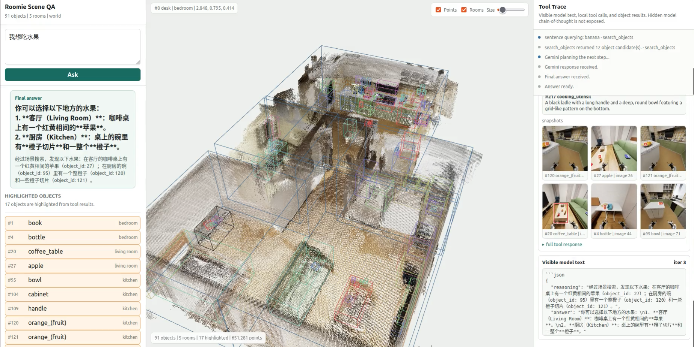
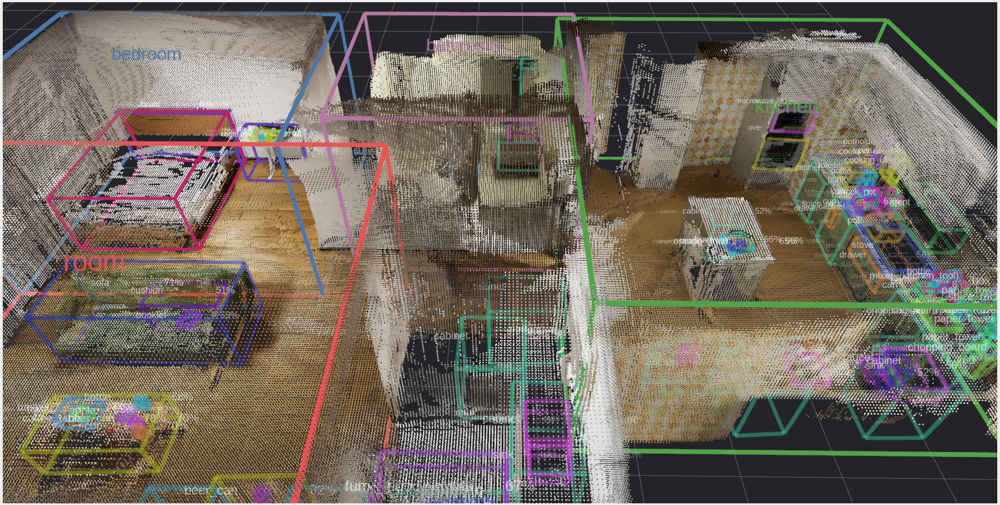
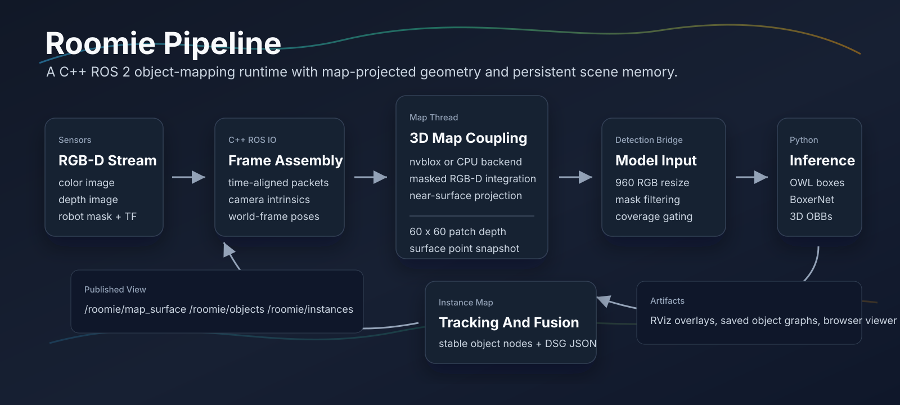
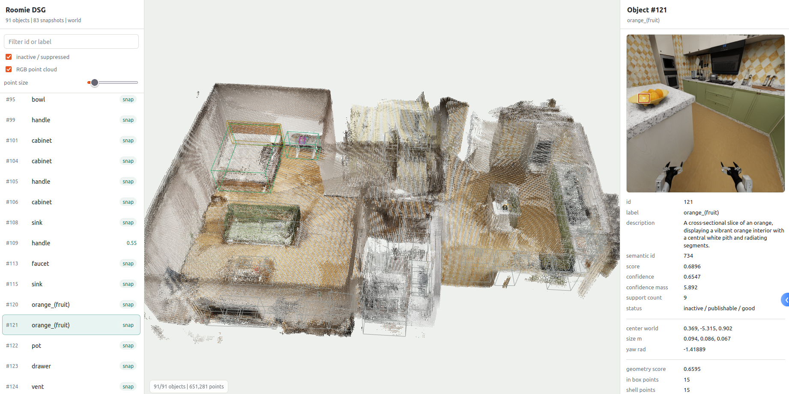

  

  <h1>Roomie</h1>

  
<strong>Map-coupled object memory for embodied agents.</strong>

  

    Roomie is a C++ ROS 2 package that turns RGB-D streams, robot masks, TF,
    and a maintained 3D map into stable object instances and a lightweight
    dynamic scene graph.
  

## Overview

Roomie is the active C++ rewrite of the Boxer online instance-mapping pipeline.
The system keeps geometry, synchronization, tracking, visualization, and
persistence inside ROS 2 C++, while Python remains a temporary inference worker
for OWL and BoxerNet.

The key design choice is that BoxerNet does not consume raw current-frame depth.
Instead, Roomie projects near-surface geometry from the maintained 3D map into
the current camera and builds the 60 x 60 patch-depth input used by the model.
This keeps detection grounded in the map state rather than a single noisy frame.

## Pipeline

## What Roomie Builds

- A map-backed RGB-D runtime with CPU and optional nvblox TSDF backends.
- 2D detection overlays and single-frame 3D oriented bounding boxes.
- Fused object tracks with confidence, support counts, geometry checks, and
  stable object IDs.
- A lightweight object-level DSG that can be saved, loaded, inspected, and used
  by downstream scene-query tools.
- RViz and browser-facing views for debugging the map, object graph, snapshots,
  labels, scores, and object descriptions.

## Runtime Surfaces

| Surface | Purpose |
| --- | --- |
| `/roomie/map_surface` | Colored map surface point cloud for RViz and debugging. |
| `/roomie/detections_2d_image` | Filtered OWL detections overlaid on the resized RGB image. |
| `/roomie/raw_detections` | Latest single-frame BoxerNet 3D OBB detections. |
| `/roomie/instances` | Lower-threshold tracked instance hypotheses. |
| `/roomie/objects` | Stable, query-facing object nodes. |
| DSG JSON | Persistent object graph with labels, OBBs, scores, geometry status, snapshots, and provenance. |

## Results

| Object Map | DSG Viewer |
| --- | --- |
|  |  |

## Package Shape

Roomie is organized around a small set of cooperating threads and interfaces:

- `RosIoThread` assembles RGB-D, robot-mask, camera, TF, and odometry data into
  mapping and detection frames. A bounded, threadless robot-state estimator
  rejects frames captured while the base is rotating.
- `MapThread` maintains the map backend and projects patch depth for inference.
- `DetectionBridgeThread` prepares model inputs and handles coverage gating.
- `PythonInferenceBackend` runs the current OWL and BoxerNet worker process.
- `InstanceMapThread` fuses detections into tracks and stable object graph nodes.
- `PublisherPersistenceThread` publishes RViz surfaces and persists the DSG.

## Status

The normal development path is the nvblox-backed Roomie pipeline. The CPU map
backend remains available for dependency-light builds, and the Python inference
worker is intentionally isolated so the C++ runtime owns the long-lived map,
object state, and persistence contracts.
