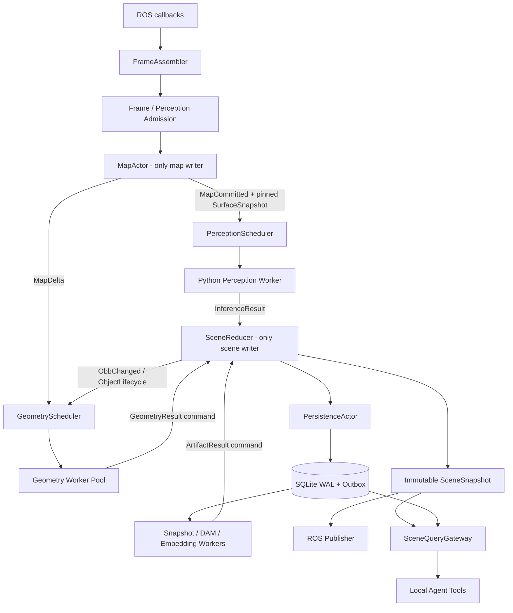

# Roomie 架构重构 Coding Plan

> 状态：可开始实现。
>
> 本文是 `roomie_arch_discussion.md` 的执行版。若本文与 `roomie_arch_opus.md`、`roomie_arch_sol.md` 或讨论稿中的未决建议冲突，以本文记录的用户决策为准。

## 0. 执行摘要

本轮不再等待架构讨论，按下面三项已确认决策实施：

1. **直接建立 typed command + 单写者 `SceneReducer`**，不走“长期拆成多把可写 mutex”的过渡架构。允许新实现先在分支内未启用，但默认切换时必须同时具备异步 geometry worker，不得把全图 geometry 计算搬进 reducer。
2. **在线 mapping 模式下，perception 必须使用“已经包含当前 FrameBundle”的精确 surface snapshot**。不再允许 mapping/detection 两条队列竞速后偶然决定输入版本。`freeze_tsdf_map=true` 是显式例外：它使用 frozen map，并在 provenance 中标明当前帧没有进入地图。
3. **运行时 current scene 以内存 revision 为准，SQLite 是异步 durable sidecar**。允许异常重启/掉电丢失少量尚未持久化 revision；公开 `latest_scene_revision` 和 `durable_scene_revision`，不得把二者混称为已经持久。

实施顺序是：先补 provenance 和度量，再修 map/surface ownership 与增量 cache，再切换 reducer/geometry，最后建设 snapshot、DAM、embedding 和 live tool。不要同时实现尚无证据的 OBB refine、多 in-flight、shared memory 或 ROI-only 存储。

## 1. 已锁定的行为契约

### 1.1 在线 perception 的“含当前帧”定义

对在线 map，FrameBundle `F` 的合法 perception 输入只能是：

```text
FrameBundle(F)
  -> MapActor 按事件时间积分 F.depth/F.rgb
  -> 完成 TSDF + color integration
  -> 增量生成 SurfaceSnapshot S(F)
  -> MapCommitted(frame_id=F.id, map_revision=R, surface=S(F))
  -> PerceptionScheduler pin S(F)
  -> project patch depth + inference
```

必须满足：

- `S(F).source_map_revision == R`，且 `R` 是完成 F 的 depth 和 color integration 后的 revision。
- `S(F)` 在发布给 scheduler 后不可变；即使 MapActor 已继续处理 F+1，F 的 inference 仍读取 S(F)。
- online mapping frame 未成功积分、surface 未成功发布或在 deadline 内等不到对应 `MapCommitted` 时，该帧不进入 perception，记录明确 drop reason。
- mapping 可以有自己的采样策略，但一旦一个 frame 被 admission 为 perception candidate，它对应的 mapping work 不得再静默 drop。
- `freeze_tsdf_map=true` 时允许直接 pin frozen snapshot；provenance 写 `map_mode=frozen`、`includes_current_frame=false`、`causality_verified=true`。

第一版不提供“previous-frame map”运行模式，避免重新引入模糊契约。若以后研究需要，新增显式枚举并重新做模型验收。

### 1.2 延迟 SLO

时延使用 `std::chrono::steady_clock` 计算，传感器时间只用于事件排序和地图因果关系。worker 完成 warm-up 并报告 Ready 后才开始统计正常运行 SLO。

| 流程 | SLO/调度约束 | 起止点 |
| --- | --- | --- |
| Perception | 正常运行 p99 不超过 10 s；默认 admission deadline 10 s | `FrameBundle.ingest_monotonic` → `ObservationCommitted` |
| 已有场景图、少量对象更新 | snapshot + DAM description + embedding 目标 p95 约 10 s | `AppearanceInvalidated` → semantic index generation 可查询 |
| 快速建图、短时间大量新对象 | 首批语义制品目标 p95 不超过 120 s | stable object commit → semantic index generation 可查询 |

调度实现约定：

- `perception.deadline_ms=10000`。尚未开始计算就过期的 request 必须 supersede；不能继续消耗 GPU。
- 已经开始但晚到的 inference result 仍进入 reducer，由 event-time/revision 规则决定应用或标记 late，不能在 response channel 静默丢失。
- ArtifactScheduler 使用两级优先级：已有对象的小批更新为 interactive；新对象 burst 为 bulk。初始 burst 判定可配置为 10 s 滚动窗口内超过 5 个 appearance invalidation。
- artifact 的 10 s/120 s deadline 是排队优先级和 SLO due time，不是销毁时间；逾期任务保留、提升优先级并记录 SLO violation。只有被更新 revision 明确 supersede 的尚未执行任务才可取消。
- SLO 是上线验收目标，不是声称模型在当前硬件上必然达到。若 DAM 单任务或模型换入本身超过 10 s，必须用指标暴露并重新选择模型驻留/调度方案，不能隐藏超时。

### 1.3 持久性语义

默认配置：

```yaml
persistence:
  scene_store_enabled: true
  flush_period_ms: 1000
  max_undurable_revisions: 32
  hard_max_undurable_revisions: 64
```

- Reducer 提交后立即发布 live `SceneSnapshot`。
- PersistenceActor 按 revision 顺序批量写 SQLite WAL，成功后推进 `durable_scene_revision`。
- graceful shutdown 必须 flush；异常掉电允许丢失 `durable_scene_revision + 1 ... latest_scene_revision`。
- 达到 soft limit 时立即提高 flush 优先级；达到 hard limit 时暂停新的 perception admission，让可靠 result queue 产生反压，避免未持久化窗口无界增长。
- map voxel/layer 不写入 SQLite；map 由 nvblox checkpoint 保存，SceneStore 只记录与 checkpoint 对齐的 map epoch/revision manifest。
- durable artifact outbox 只有在对应 scene revision 已落盘后才能被 worker lease。这样 crash 后不会留下引用一个从未恢复 scene state 的孤儿任务。

### 1.4 不破坏的外部兼容面

重构期间默认保持以下接口：

- 现有 ROS 输入 topic、RViz 输出 topic 和 `/roomie/save_dsg` service 名称。
- 现有 `roomie_object_graph` / `roomie_manual_scene_graph` 可导入。
- 在 schema v3 完成前继续导出当前 JSON 字段；新增 revision/provenance 字段采用向后兼容方式。
- CPU map backend 保持可构建、可测试；不支持 dirty block 时走明确的 full-snapshot fallback。

内部 C++ API、Python IPC wire version 和类名允许不兼容修改。

## 2. 最终线程/进程拓扑



写入规则：

- MapActor 是 nvblox layers、map revision、surface snapshot 的唯一写者。
- SceneReducer 是 track、object、relation、current artifact pointer 的唯一写者。
- PersistenceActor 只持久化 reducer 已提交的有序 delta，不反向自行修改 current scene。
- worker 只返回 candidate result；所有 current-state effect 都重新作为 typed command 进入 reducer。
- publisher、query、export 只读 immutable snapshot，不获取 map/reducer 的长临界区锁。

## 3. 公共数据契约

### 3.1 ID 与地图版本

在 `include/roomie/pipeline/types.hpp` 或新的 `include/roomie/core/version_types.hpp` 定义：

```cpp
struct RunId {
  std::uint64_t high = 0;
  std::uint64_t low = 0;
};

using FrameId = std::uint64_t;
using RequestId = std::uint64_t;
using SceneRevision = std::uint64_t;

enum class MapMode { kOnline, kFrozen };

struct MapStamp {
  RunId map_epoch;
  std::uint64_t map_revision = 0;
  TimeNanoseconds integrated_through_ns = 0;
};

struct SurfaceStamp {
  RunId map_epoch;
  std::uint64_t surface_revision = 0;
  std::uint64_t source_map_revision = 0;
};

struct FrameProvenance {
  RunId run_id;
  FrameId frame_id = 0;
  RequestId request_id = 0;
  TimeNanoseconds sensor_time_ns = 0;
  MapMode map_mode = MapMode::kOnline;
  bool includes_current_frame = false;
  bool causality_verified = false;
  MapStamp map;
  SurfaceStamp surface;
};
```

约束：

- `frame_id` 在一个 run 内单调且唯一；`run_id + frame_id` 跨重启唯一。
- retry/new model invocation 使用新 `request_id`，但可保留相同 `frame_id`。
- load/reset/new map 生成新 `map_epoch`；同一 epoch 内 revision 只增不减。
- 不再用 `time_ns + camera_id` 作为请求唯一键。

### 3.2 FrameBundle 与 MapCommit

用共享 immutable buffer 避免 MappingFrame/DetectionFrame 重复复制：

```cpp
struct FrameBundle {
  FrameId frame_id;
  RunId run_id;
  TimeNanoseconds sensor_time_ns;
  std::chrono::steady_clock::time_point ingest_time;
  std::string camera_id;
  std::shared_ptr<const ImageBuffer> rgb;
  std::shared_ptr<const DepthBuffer> depth;
  std::shared_ptr<const ImageBuffer> robot_mask;
  CameraIntrinsics intrinsics;
  Eigen::Isometry3f T_world_camera;
  std::uint64_t calibration_revision;
  SyncDiagnostics sync;
};

struct MapCommit {
  FrameId frame_id;
  MapStamp map;
  SurfaceStamp surface;
  std::shared_ptr<const SurfaceSnapshot> snapshot;
  MapDelta delta;
};
```

可以在第一阶段先让旧 frame structs 携带相同 ID，再在 causal admission PR 中完成共享 FrameBundle，避免第一笔改动过大。

### 3.3 Scene command/event

初始 command 集：

```text
LoadSceneCommand
ApplyObservationBatchCommand
ApplyGeometryResultCommand
ApplySnapshotSetCommand
ApplyDescriptionArtifactCommand
ApplyHumanAnnotationCommand
PersistedThroughCommand
ShutdownCommand
```

初始 committed event 集：

```text
SceneRevisionCommitted
ObjectCreated / ObjectUpdated / ObjectMerged / ObjectTombstoned
ObbChanged
GeometryInvalidated / GeometryCommitted
AppearanceInvalidated / SnapshotSetCommitted
DescriptionInvalidated / DescriptionCommitted
RelationInvalidated / RelationCommitted
```

禁止 subscriber 在 committed event callback 中直接拿可变 SceneState 指针。需要改变状态时必须 enqueue 新 command；Reducer 不允许同步嵌套 commit。

### 3.4 Worker dependency token

```cpp
struct ObjectDependency {
  int object_id = -1;
  std::uint64_t identity_revision = 0;
  std::uint64_t obb_revision = 0;
  std::uint64_t appearance_revision = 0;
  std::uint64_t semantic_revision = 0;
};

struct GeometryDependency {
  ObjectDependency object;
  SurfaceStamp surface;
  std::vector<BlockIndex> evaluated_blocks;
};
```

- Geometry 依赖 object identity/OBB 与局部 surface blocks。
- DAM 默认依赖 identity + appearance + snapshot set hash + model/prompt/schema；不依赖每次 raw OBB revision。
- Embedding 依赖 normalized semantic document hash + embedding model id。
- merge/delete 通过 alias/tombstone 解析；不能重新使用 object id。

## 4. PR/里程碑实施计划

下面编号是依赖顺序，不要求每一项必须对应远程平台上的单个 PR。每项都应保持可编译、测试通过；标记为“同一切换里程碑”的项在全部完成前不得打开默认路径。

### PR-01：Provenance、IPC v2 与 baseline 指标

目标：只增加身份、版本和分段计时，不改变 detection/track 算法行为。

主要改动：

- `types.hpp`：加入 run/frame/request/map/surface stamp；MappingFrame、DetectionFrame、InferenceRequest/Response 先携带 provenance。
- `RosIoThread`：每次成功组装逻辑 frame 分配一个 `frame_id`，mapping/detection 副本使用同一个 id。
- `MapThread/MapBackend`：返回当前 map/surface stamp；尚未实现精确 causal 前写 `includes_current_frame=false`、`causality_verified=false`，禁止伪造已验证的因果关系。
- `DetectionBridgeThread`：分配 `request_id`；`pending_debug_frames_` 改用 request id，而不是 `time_ns + camera_id`。
- `PythonInferenceBackend` 与 `roomie_python_inference_worker.py`：协议 magic 升级为 v2，request/response 对称传输全部 provenance。
- `RunLogger`：统一打印 `run_id/frame_id/request_id/map_epoch/map_revision/surface_revision`。
- 增加 serialize、pipe write/read、worker queue、preprocess、GPU、response forwarding 分段 timing。

测试：

- C++/Python wire-format round trip；截断、错误 magic、超大 body。
- 相同 camera/time 的两次 retry 由 request id 正确区分。
- response 中的 map/surface stamp 与 request bit-exact 相同。
- 老的功能测试结果在忽略新增字段后不变。

验收：

- 任意一条 object observation 可从日志追溯到唯一 frame/request 和 surface。
- 采集至少一段真实 bag baseline，保存各阶段 p50/p95/p99、queue depth、现有 drop 数。

### PR-02：有业务语义的 BoundedChannel

目标：淘汰无法观察副作用的统一 `pushDropOldest()`。

新增抽象：

```text
ChannelPolicy: DropOldest | RejectNewest | ReliableBlocking | LatestByKey
PushOutcome: Accepted | Replaced | Rejected | TimedOut | Stopped
ChannelStats: depth, high_watermark, oldest_age, accepted, replaced,
              rejected, producer_wait, consumer_wait
```

初始 policy：

| Channel | Policy |
| --- | --- |
| 未被 perception 选中的普通 sensor/map 输入 | 显式 DropOldest |
| perception request | LatestByCamera/可 supersede，带 deadline |
| Python response | ReliableBlocking |
| reducer command/result | ReliableBlocking |
| geometry request | LatestByObject |
| publisher revision notification | Latest |

实现要求：

- reliable producer 在 channel 满时等待并传播反压；stop 必须唤醒所有 reader/writer，禁止 shutdown deadlock。
- `Replaced` 必须返回被替换项的 reason/id 以便记录；不得仍返回普通成功。
- queue age 使用 steady clock，在 dequeue 时统计。
- Pipeline stop 顺序调整为先停止 admission，再 drain/stop producer，最后停止 reducer；不要先 stop result queue 导致 worker 丢最后结果。

测试：

- 各 policy 的容量 0/1/N、并发 producer/consumer、stop while blocked。
- 压满所有 inference channels，确认 response 数与 worker 完成数一致。
- ThreadSanitizer 可用时跑 channel 单测。

### PR-03：MapActor 拥有 surface refresh，publisher 纯只读

目标：解除 publisher → cache rebuild → perception 的优先级倒置。

主要改动：

- `MapThread` 演化为 MapActor：唯一调用 `integrateFrame()`、推进 map stamp、构建/发布 SurfaceSnapshot。
- Map backend reader API 改为返回 `shared_ptr<const SurfaceSnapshot>`；projection 接收显式 pinned snapshot。
- publisher 从 atomic/shared immutable snapshot 构建点云，不再调用可能 rebuild 的 `debugSnapshot()`。
- C++17 使用 `std::atomic_load/std::atomic_store` 的 shared_ptr free functions，不能误用 C++20 才完整支持的 `std::atomic<std::shared_ptr<T>>`。
- 第一版允许每次 refresh 仍全量构建，但 refresh 的触发和 ownership 必须正确；`surface_cache_rebuild_period_sec` 只作为兼容/full fallback 参数，不再由 reader 触发。
- CPU backend 实现 full-snapshot fallback。

测试与验收：

- 开关 RViz publisher 不影响 surface revision 推进。
- publisher 慢消费时 map/perception 不等待 publisher。
- pinned snapshot 在后续 map integration 后内容不变。
- 相同输入下，旧 full surface 与新 full snapshot 的点/颜色/voxel ref 等价。

### PR-04：Nvblox dirty-block 增量 SurfaceSnapshot

目标：每个 map commit 只重建 TSDF/color 发生变化的 blocks，并为精确 include-current snapshot 提供足够低成本的 COW。

已验证的本地 API：

- `ProjectiveTsdfIntegrator::integrateFrame(..., std::vector<Index3D>* updated_blocks)`：`nvblox/include/nvblox/integrators/projective_tsdf_integrator.h`
- `ProjectiveAppearanceIntegrator<ColorLayer>::integrateFrame(..., updated_blocks)`：`projective_appearance_integrator.h`
- `Mapper::tsdf_integrator()`、`color_integrator()`、`tsdf_layer()`、`color_layer()` 均有 public non-const accessor。

实现细节：

1. NvbloxMapBackend 与 Mapper 使用同一个 `shared_ptr<nvblox::CudaStream>`；避免 direct integrator、image upload 和 GPU hash update 分属未同步 stream。
2. direct 调用 TSDF integrator，收集 `tsdf_updated_blocks`，随后调用 TSDF layer `updateGpuHash()`。
3. direct 调用 color integrator，传入 aligned depth，收集 `color_updated_blocks`，随后调用 Color layer `updateGpuHash()`。
4. 同步 stream 后取两者并集，形成 `MapDelta.changed_blocks`；同一 frame 的 depth/color 完成后才增加 map revision。
5. 不读取或消费 Mapper 的 `BlocksToUpdateTracker`，避免影响 mesh/streamer。
6. 注意 direct integrator 绕过 Mapper wrapper 的 side effects：
   - Roomie 当前没有配置 depth preprocessing；第一版应显式断言/记录该模式未启用，否则必须复刻 preprocessing。
   - `updateGpuHash()` 必须补齐。
   - Mapper 保存 last posed depth 和内部 tracker 的逻辑不被 Roomie 当前功能依赖；用回归测试证明。以后若调用依赖这些状态的 Mapper API，必须重新评估。
7. load/new epoch 的第一次 snapshot 走全量 rebuild；dirty set 缺失、revision gap、reset/clear 也走全量 fallback。
8. Surface block 采用 immutable shared block；新 snapshot 复用未变化 block。第一版允许复制 block pointer table，但不复制未变化点数组。
9. dirty block 重新提取后若已无合格 surface voxel，必须从新 snapshot 删除旧 block。

测试：

- 对同一组 frame，每一 revision 比较 incremental snapshot 与强制 full rebuild：按 block/voxel ref 比较 position、TSDF weight/distance、RGB；不依赖 vector iteration order。
- 覆盖 robot mask、空深度、color-only 变化、block 变空、load map、frozen map。
- 连续积分期间 pin 旧 snapshot，确认 block COW 没有被原地修改。
- 记录 dirty/full block ratio、cache build p50/p95、map mutex hold、surface lag 和内存峰值。

### PR-05：FrameBundle、精确 include-current barrier 与 PerceptionScheduler

目标：正式启用用户确认的“含当前帧”模型契约。

主要改动：

- RosIo/FrameAssembler 输出一个共享 FrameBundle，不再独立复制并投递 MappingFrame 与 DetectionFrame。
- Admission 先决定 frame 是否进入 online mapping，以及是否成为 perception candidate。
- perception candidate 对应的 map work 进入 reliable barrier；MapActor 返回相同 frame id 的 MapCommit。
- PerceptionScheduler 只有同时持有 FrameBundle 和它的 MapCommit 时才能创建 request，并 pin commit 中的 exact SurfaceSnapshot。
- MapCommit 比 detection frame 先到或后到都支持；pending 表有容量和 10 s deadline，过期清理并记录原因。
- patch projection 从 backend mutex 中彻底移出，只读取 pinned snapshot blocks。
- max FPS 保留为预算上限；还应检查 deadline、in-flight、queue age。第一版仍是单 in-flight。
- frozen map 路径显式使用 frozen snapshot，不等待当前 frame map barrier。

测试：

- 人为调换 map/detection 到达顺序，最终 request 使用相同 source map revision。
- MapActor 快速处理 F、F+1 后，F request 仍 pin S(F)，不读取 S(F+1)。
- map frame reject/failure、surface build failure、deadline、shutdown 时不泄漏 pending FrameBundle。
- 在线 request 全部满足 `includes_current_frame=true && causality_verified=true`；frozen request 全部满足 `includes_current_frame=false && causality_verified=true`。
- 可重复 bag replay 中，frame → surface revision 关联确定，不受线程调度影响。

### PR-06：Scene 数据模型与 Reducer 骨架

目标：直接建立最终单写者写路径；本 PR 与 PR-07 属于同一默认切换里程碑。

新增建议目录：

```text
include/roomie/scene/scene_command.hpp
include/roomie/scene/scene_event.hpp
include/roomie/scene/scene_state.hpp
include/roomie/scene/scene_snapshot.hpp
include/roomie/scene/scene_reducer.hpp
src/scene/scene_reducer.cpp
```

实现内容：

- SceneState 拆为 identity/lifecycle、geometry、semantic、annotation、artifact components，各自有 revision。
- SceneReducerThread 持有唯一 mutable SceneState、tracks 和 ObjectGraph materialized view。
- 将 inference response 转为 immutable ObservationEvent，再作为 `ApplyObservationBatchCommand` 入 reducer。
- 搬迁现有 association、promotion、merge、track aging 逻辑；第一版保持算法公式和阈值，不夹带调参。
- track aging 至少区分 `perception skipped` 与 `visible-but-unmatched`；完整 occlusion 以后实验。
- merge 建 alias，delete 建 tombstone，object id 永不复用。
- 每次 commit 发布 immutable SceneSnapshot 和 committed events；publisher/InstanceStore API 改为 snapshot provider。
- graph load 在 reducer start 前构造初始 state，或作为首个同步 command；不能从别的线程直接改 state。
- 对外 snapshot 使用 component structural sharing；不得每次 deep-copy observation history、surface 或图片。
- 旧 `InstanceMapThread` 不作为第二套可写 current state 长期保留。允许在 feature branch 对照测试，但默认切换时移除双写。

测试：

- 固定 observation 序列 deterministic replay，比较 scene snapshot hash。
- command 顺序、bounded late observation、duplicate timestamp/retry。
- promotion/merge/delete 后 alias 解析；晚到 result 不得复活 tombstone。
- publisher 并发读时只能看到完整 revision，不出现 track 已更新但 graph 未更新的混合状态。
- 现有 object graph load/save、freeze workflow 在兼容模式下不回归。

### PR-07：异步局部 GeometryScheduler/Worker 与 CAS

目标：geometry 从 reducer 临界路径完全移出，并由 MapDelta/ObbChanged 主动驱动。

主要改动：

- 将 `evaluateGeometryAgainstSurface()` 抽成无全局状态的 pure evaluator。
- GeometryInput 只含 object id、identity/OBB revision、OBB 参数、阈值和 pinned SurfaceSnapshot。
- GeometryScheduler 订阅 MapDelta、ObbChanged、ObjectCreated；同一 object 只保留最新任务。
- 建 object expanded-AABB spatial index，dirty block 只查询相交对象；surface snapshot 按 block AABB 返回局部点。
- GeometryResult 携带实际 evaluated block set 和 dependency token，经 reducer command 提交。
- CAS 规则：
  1. 解析 canonical object id；identity/OBB revision 不同则 supersede。
  2. map epoch 不同则 reject。
  3. current surface revision 相同则接受。
  4. current 更新时，查询 bounded MapDelta journal；若 `(source,current]` 没有与 evaluated blocks 相交则可接受，否则 supersede 并重排。
  5. delta journal 有缺口时保守 reject。
- duplicate merge 候选先由空间邻域缩小，再运行现有精确判定；不在本阶段改变 merge 评分。
- 不实现 geometry suggested OBB/refine。

测试与验收：

- 局部 evaluator 和旧全 surface evaluator verdict/score 等价。
- MapDelta 只触发相交对象；map 变化即使没有 inference response 也能触发重评。
- object OBB 在 worker 运行中改变，旧 result 被拒；无关远处 map delta 不导致误拒。
- reducer command latency 不包含 surface 点扫描；持续 geometry 负载下 publisher/query 仍可读。
- PR-06/07 全部通过后一次性切换默认 reducer 路径，不保留锁内 geometry fallback。

### PR-08：异步 SQLite SceneStore 与 durability watermark

目标：实现用户接受的有限丢失语义，并为 durable artifact outbox 打地基。

主要改动：

- 增加 SQLite3 build/runtime dependency，启用 WAL；schema 采用显式 migration version。
- PersistenceActor 订阅有序 SceneCommit delta，批量事务写 current/history、alias、tombstone、artifact intent。
- 维护 atomic `latest_scene_revision`、`durable_scene_revision` 和 oldest undurable age。
- restore 时加载最后 durable snapshot/delta；生成新的 run id，延续 object ids，不延续旧 map epoch。
- save DSG service 改为 pin 某个 SceneSnapshot 后后台导出；service 返回 job/revision 或在有界时间内等待，不能锁住 reducer。
- JSON 仍是兼容 export，不作为运行时写回源。
- sidecar 落盘积压达到 hard limit 时通知 admission 反压。

建议初始表：

```text
schema_meta
scene_revisions
objects_current / object_history
relations_current / relation_history
object_aliases / tombstones
artifact_intents / artifacts
tasks / task_attempts
map_checkpoint_manifest
```

测试：

- 每个可能的 batch 边界 kill persistence process/thread，恢复结果严格等于最后 durable revision。
- graceful shutdown 后 durable==latest。
- SQLite busy/disk full 时 live 可短暂前进，但达到 hard lag 后 admission 被限制且指标报警。
- old JSON 导入、new JSON 导出 round trip。

### PR-09：在线 SnapshotBank 与 AssetStore

目标：正常 mapping 即产生可追踪、多视角 snapshot，不再要求 freeze 重跑。

第一版锁定实现：

- `snapshot.top_k=3`，配置可调；用 azimuth/elevation/尺度分桶保持多样性。
- AssetStore 对 full frame 做内容寻址和跨对象去重；第一版使用 lossless PNG，object 保存 bbox/crop transform/mask ref。编码策略以后基于 corpus benchmark 调整。
- frame ring 有 TTL/容量；候选入选后必须 materialize，不能永久引用易失内存。
- 当前没有实例 mask 时保留 bbox fallback 并明确记录 `mask_source=bbox_fallback`。
- 质量分保留现有 confidence/edge/distance/position/size，同时暴露分项；增加 blur、exposure、truncation。patch-depth occlusion 暂不进入 hard gate，先 shadow 记录。
- tentative track 候选在 promotion 时迁移；merge 通过 alias 合并候选并重新选 Top-K。
- 只有 snapshot set 的有效像素证据发生变化才增加 appearance revision。
- frozen remaker 变成兼容导入/补图入口，底层也写 SnapshotBank，不再维护第二套 StoredBest 事实源。

测试与验收：

- 在线新对象无需第二趟 freeze 即拥有 primary snapshot。
- 相同 frame 多对象只保存一份 full-frame asset。
- Top-K 满足质量迟滞和视角多样性；merge 后无重复/悬空引用。
- crash/restart 后已 durable asset 可解析，未引用 asset 经 grace-period GC。
- existing graph 少量对象更新时，primary snapshot ready 纳入 10 s artifact SLO。

### PR-10：Durable ArtifactScheduler 与 DAM worker

目标：把 DAM 从串行改 JSON 脚本变为 revision-aware、可恢复任务。

任务唯一键：

```text
(object_id, identity_revision, appearance_revision, snapshot_set_hash,
 dam_model_id, prompt_hash, output_schema_version)
```

实现内容：

- PersistenceActor 将 durable appearance intent 与 DAM outbox 在同一 transaction 提交。
- Worker lease 有 owner、expiry、heartbeat、attempt、backoff；执行语义为 at-least-once，effect 由 reducer CAS 幂等。
- 复用现有 `roomie_dsg_dam_describe.py` 的模型加载/query 逻辑，拆成常驻 worker；禁止 worker 直接写 scene JSON。
- 输出采用 `roomie_arch_sol.md` 定义的结构化 schema；保留 `raw_text`。schema parse/repair 失败时可提交 `unstructured_fallback`，不能伪装成完整结构化事实。
- DAM 默认只依赖 appearance，不因普通 OBB fusion 重跑；若以后 prompt 消费 3D 几何，加入量化 geometry signature，而不是 raw revision。
- interactive 任务 due time 10 s，bulk 任务 120 s；逾期不丢弃并记录 SLO violation，同一对象新 revision 才可 supersede 尚未开始的旧任务。
- perception 永远高于 DAM。第一版每个 DAM job 边界重新检查 perception backlog/GPU lease；不在没有 benchmark 时做进程级硬抢占。
- 若 Boxer/DAM 无法同时驻留显存，先实现明确的 quiet-window 模式和 SLO violation 指标，再根据实测做模型驻留策略。
- DAM artifact 持久化与 `EmbeddingRequested(document_hash)` 必须处于同一 durable transaction；reducer 只在 durable ack 后把新 description 标为 current-ready。等待期间旧 description 作为带 stale 标识的 fallback。

测试：

- 使用 fake DAM worker 验证 lease expiry、重复执行、crash retry、stale snapshot result、merge alias。
- schema valid/repair/fallback 三条路径。
- interactive 优先于 bulk；burst 时任务在 120 s 目标内推进且不破坏 perception 10 s deadline。
- 原离线脚本可改为“提交任务并可选等待”的兼容 CLI。

### PR-11：异步 Embedding 与 versioned index

目标：tool call 不再触发模型冷启动和全量编码。

实现内容：

- EmbeddingWorker 启动预热，默认 CPU；按短窗口 batch durable jobs。
- semantic document 由 label、结构化 DAM retrieval fields、human tags 确定性生成；room/position/active 等作为 metadata filter，不进入高频失效文本。
- 持久记录 `(object_id, document_hash, model_id, vector, created_scene_revision)`。
- 小规模初版使用 normalized contiguous matrix + delta index；后台构建新 generation 后 atomic swap。
- model upgrade 建新 namespace，完整后切换；禁止混合不同 model/dimension。
- description 已变但 embedding pending 的对象加入 lexical delta，搜索合并并返回 freshness。

测试与验收：

- 首次 `search_objects` 不加载模型、不全量 encode。
- 单对象 semantic 更新只编码该 document；delete/merge 正确更新 index。
- index build 期间 query pin 旧 generation；切换后旧 read token 在 TTL 内仍可读或得到明确 expired。
- interactive 少量更新纳入 10 s 目标，bulk 纳入 120 s 目标。

### PR-12：Live SceneQueryGateway 与本地 tools

目标：agent 从 live versioned state 查询，不再绑定启动时的静态 GraphStore。

实现内容：

- QueryGateway 创建 `SceneReadToken(scene_revision, index_generation, expires_at)`。
- 所有 tool handler 默认使用同一 token；返回 scene/index revision、as-of time、geometry/semantic freshness、pending artifacts。
- `search_objects` pin index generation，并校验 vector row document hash 与 pinned object semantic revision；不一致走 pinned lexical delta。
- `get_object/get_objects_near/rooms/inspect_snapshot` 读取同一 SceneSnapshot 和 AssetStore generation。
- 保留离线 JSON GraphStore 作为测试/兼容 adapter，但在线默认不再使用。
- Gemini function registry、本地 MCP/其他 adapter 复用同一业务 handler，不复制 schema。

测试：

- agent 多轮 tool call 期间 live scene 持续变化，旧 token 仍看到一致对象/关系/描述集合。
- index generation 中途切换不污染旧 answer。
- token expiry、artifact pending、stale fallback 明确返回。
- tool latency 不包含 DAM/embedding 模型计算。

### PR-13：Canonical rooms/relations、schema v3 与清理

目标：完成单一事实源，删除三份 JSON 的人工同步职责。

主要改动：

- room/human annotation 通过 `ApplyHumanAnnotationCommand` 进入 reducer。
- room containment 等派生 relation 在 object geometry 或 room revision 改变时局部重算。
- schema v3 只导出一份 canonical objects；manual envelope importer 检测顶层/嵌套冲突并告警。
- description 不再默认等于 label；UI/query 层负责 fallback。
- 移除旧 remaker/DAM/embedding 的直接 JSON current-state 写入路径。
- 清理已废弃 period、queue 和 freeze-only snapshot 配置，提供迁移日志。

## 5. 跨 PR 的测试与基准设施

### 5.1 单元测试

- version/ID/wire codec round trip。
- channel policy、stop/backpressure。
- SurfaceBlock COW 与 incremental/full equivalence。
- reducer deterministic replay、CAS、alias/tombstone。
- geometry local/full equivalence。
- SnapshotBank Top-K、hash/refcount/GC。
- outbox lease、retry、idempotency。
- index generation 和 SceneReadToken。

### 5.2 集成测试

新增一个可脚本化的 bag replay harness，输出机器可读 JSON 指标：

```text
frame admission/drop reasons
map/surface revision timeline
dirty/full block ratio
surface/map lock hold
inference queue/worker/GPU/roundtrip
scene commit/reducer queue
geometry scheduled/accepted/superseded
live/durable revision lag
snapshot/description/embedding freshness
tool latency and pinned revisions
```

至少保留三套场景：

1. online 慢速移动持续建图；验证 include-current 和 dirty blocks。
2. frozen existing graph + 少量对象更新；验证 10 s artifact 优先级。
3. 快速出现大量对象；验证 120 s bulk、GPU admission 和 bounded storage。

### 5.3 故障注入

- Python worker 在 read/write/inference 各阶段退出。
- response/result channel 饱和。
- geometry 运行中 map epoch 切换、object merge/delete。
- DAM 运行中 snapshot 替换。
- SQLite busy、disk full、进程在 batch commit 前后退出。
- AssetStore 文件缺失/损坏。
- index 构建中进程退出。

## 6. 每个里程碑的 Definition of Done

### Gate A：可观测因果链（PR-01～02）

- 所有 frame/request/result 有唯一 ID 和完整 provenance。
- 所有 drop/replacement/backpressure 可计数、可定位。
- inference result 无静默丢失。
- 已保存真实 bag baseline。

### Gate B：确定性含当前帧地图（PR-03～05）

- publisher 永不触发 cache rebuild。
- incremental 与 full surface 等价测试通过。
- 每个 online perception request pin 与自身 frame 对应的 exact surface。
- perception 正常运行 p99 满足 10 s，或明确给出模型/硬件瓶颈报告。

### Gate C：单写者实时 scene（PR-06～08）

- 只有 reducer 能修改 current scene。
- geometry 不在 reducer/scene-state 临界区扫描 surface。
- MapDelta 可独立驱动局部重评，stale result 不能覆盖新状态。
- live/durable watermark 与异常恢复语义经过故障测试。

### Gate D：在线语义制品（PR-09～11）

- online object 自动获得 Top-K snapshot、description 和 embedding。
- existing small update 与 new-object burst 使用不同优先级/SLO。
- DAM/embedding failure 可恢复、可重试、不会阻塞 perception。
- 所有 artifact 有 input hash、model/prompt/schema 和 evidence provenance。

### Gate E：Live agent memory（PR-12～13）

- 一次 agent answer 读取一致 scene/index revision。
- JSON 只是兼容导出；rooms/relations/descriptions 无第二事实源。
- legacy graph 可导入，现有 viewer/tool 主要能力不回归。

## 7. 明确延期、不得夹带的工作

以下事项必须作为独立实验，不得混入上述核心 PR：

- geometry/PCA suggested OBB 写回融合；只允许 shadow metric。
- N in-flight、micro-batch、CUDA streams 并行。
- memfd/POSIX shared-memory 图像 IPC。
- patch-depth 遮挡分数进入 snapshot hard gate。
- ROI-only、JPEG/WebP 等最终资产编码选择。
- HNSW/FAISS 等大规模向量库。
- 复杂 free-space occlusion 的 visibility-aware aging。

这些实验都必须先有 baseline、单独 feature flag、回归数据和明确通过门限。

## 8. Coding agent 执行规则

1. 每次只推进一个编号 PR 的目标，不顺手重写阈值算法。
2. 开始前阅读本计划、讨论稿以及将修改模块的现有测试；保留用户无关改动。
3. 先补失败测试/基准，再改实现；涉及并发必须包含饱和和 shutdown 测试。
4. 所有新异步结果必须带 dependency token；禁止用“拿最新对象再直接覆盖”代替 CAS。
5. 所有 queue 满载行为必须显式；禁止重新引入无返回信息的 drop-oldest。
6. 所有 long-running worker 必须有 deadline、stop、heartbeat/restart 或 lease-expiry 语义。
7. 不修改本地 nvblox 依赖源码作为 Roomie 正常构建前提；direct integrator 的行为差异由 Roomie adapter 和等价测试负责。
8. 每个 PR 更新配置说明、指标字段和迁移说明，并记录真实 bag 前后对比。
9. PR-06/07 在同一 feature branch 完成后再切默认，避免交付“有 reducer 但 geometry 又回到 reducer 中计算”的半成品。
10. 遇到本文未覆盖且会改变外部契约、数据丢失窗口或模型输入分布的问题时停止并请求决策；纯内部类型、文件拆分和测试结构由 coding agent 自主决定。

## 9. 推荐立即开始的工作

立即从 PR-01 开始，然后依次完成 PR-02、PR-03、PR-04。它们已经没有产品决策阻塞，并会给后续 reducer 重构提供可验证的 baseline。

PR-04 的 dirty-block 公共 API 已在本地 nvblox 源码确认；实现时真正需要防范的是绕过 Mapper wrapper 后遗漏 side effect，而不是 dirty set 本身拿不到。PR-05 完成后才正式宣告 perception 的“含当前帧”契约生效。

到 Gate B 时先提交一次完整 benchmark/report，再进入 PR-06/07 的 reducer 默认切换。后续各阶段都复用同一套 ID、revision、command、outbox 和 freshness 契约，不允许 snapshot、DAM、embedding 或 tool 各自再造私有任务系统。
