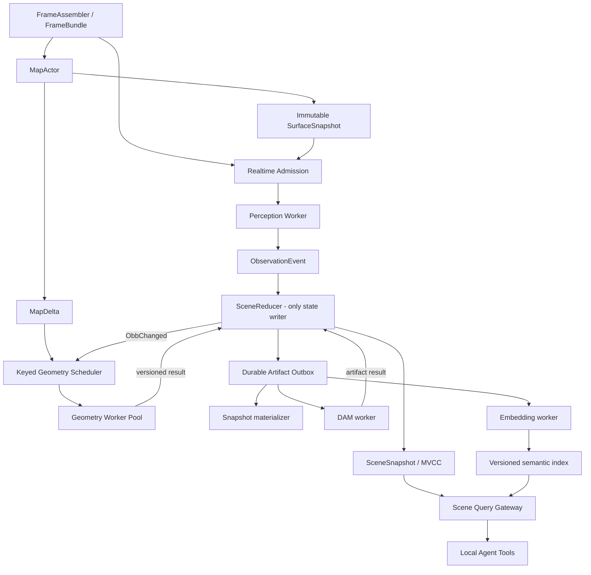

# Roomie 架构方案讨论稿：对 `roomie_arch_opus.md` 与 `roomie_arch_sol.md` 的求同存异

## 0. 讨论结论

两份方案在目标上高度一致，约八成内容可以直接合并。共同判断是：Roomie 的主要矛盾不是少几个线程或参数没有调好，而是缺少**版本化状态、局部失效、明确的调度语义和可恢复的异步制品链**。

建议把双方方案合并为下面这条主线：

1. `MapActor` 成为 nvblox 唯一写者，主动产出带 revision 的 immutable `SurfaceSnapshot` 和 `MapDelta`，publisher 不再驱动 surface cache 更新。
2. perception response 先变成带完整 provenance 的 `ObservationEvent`；`SceneReducer` 是 track/object/relation current state 的唯一提交者。
3. geometry 从 `applyDetections()` 临界区移出，由 `MapDelta + ObbChanged` 局部触发；worker 在 pinned surface 上计算，reducer 用 dependency token/CAS 防止旧结果覆盖新状态。
4. 实时队列、可合并任务、可靠结果和 durable DAM/embedding 使用不同的 channel policy，不再统一 `pushDropOldest`。
5. snapshot 在线化并保留 Top-K 多视角证据；DAM 和 embedding 由内容哈希与组件 revision 驱动，进入持久 outbox。
6. objects、rooms、relations、descriptions 只有一个 canonical state；JSON 是兼容导出，不再是三份人工同步的事实数据库。
7. agent tool 从 live query gateway 读取，并在一次回答中 pin 同一个 scene/index revision。

双方真正需要讨论的不是上述方向，而是以下实现选择：

- 写路径采用“任意 event subscriber 回调”还是“typed command + 单写者 reducer”。
- 短期拆多把 mutex，还是尽快建立单写者并发布 immutable snapshot。
- geometry 是否应该反向 refine OBB，以及使用什么证据和安全门限。
- Python 推理应多 in-flight、batch，还是继续单 in-flight 但做 deadline admission。
- shared memory、SQLite 热路径、ROI-only snapshot 等优化是否已有数据支持。
- DAM 的失效依赖是否包含每次 `obb_revision`，还是只依赖真正改变视觉证据的 appearance revision。

本文建议：**状态写入采用 reducer，事件用于通知；先补 provenance/metrics，再做 map/surface 局部化；OBB refine、multi-in-flight、shared memory 等保留为有验收门槛的实验项。**

## 1. 双方已达成的共识

| 主题 | `roomie_arch_opus.md` 的主张 | `roomie_arch_sol.md` 的主张 | 合并结论 |
| --- | --- | --- | --- |
| 状态中心 | 不可变 `WorldState` + event bus | `SceneReducer` + MVCC `SceneSnapshot` | 逻辑上统一不可变世界状态；物理写入由单一 reducer 串行提交 |
| 地图 surface | dirty blocks、增量 `SurfaceBlockCache` | `MapActor`、block COW snapshot、map/surface revision | MapActor 主动增量提取并发布 immutable block snapshot |
| geometry | 脏块反查对象，独立 geometry thread | MapDelta + spatial index + keyed worker + CAS | geometry 退出 detection 路径，只处理受影响对象，结果做版本校验 |
| publisher | 不得触发 cache rebuild | 只读 immutable latest revision | publisher 是低优先级读者，永不阻塞地图/感知写路径 |
| 推理队列 | 反压、丢帧可观测、worker 自愈 | deadline、latest-per-camera、可靠 result、supervisor | admission、drop/backpressure 和 result reliability 分开定义 |
| snapshot | 在线化、Top-K、多质量指标 | SnapshotBank、视角多样性、AssetStore、provenance | 在线候选库 + primary/alternate + 有界资产生命周期 |
| DAM | 服务化、内容哈希、异步队列 | durable outbox、结构化 artifact、stale CAS | DAM 是可恢复的派生任务，不能直接改 current JSON |
| embedding | 持久化、按 text hash 增量 | 预热 worker、batch、index generation/freshness | 不在首次 tool call 中全量编码；对象级 upsert 和原子索引切换 |
| rooms/relations | 提升为 WorldState 一等公民 | canonical graph、字段 ownership、局部关系失效 | 去除顶层/嵌套双 object list，人工标注也提交 versioned patch |
| 可观测性 | drop、lock wait、revision lag | trace id、queue age、stale reject、artifact lag | 建立 frame → map → inference → scene → artifact 的端到端 trace |

### 1.1 对当前根因的共同事实判断

两份文档共同确认了以下代码事实：

- `RosIoThread::run()` 基本空等，实际拼帧发生在 ROS callbacks；RGB、depth、mask、TF 共用状态锁和 latest-slot 模型。
- mapping 与 detection 走独立队列，没有 map event-time watermark；检测使用哪一版地图由处理时序偶然决定。
- `PatchDepth.map_version` 进入 Python request，却没有随 `InferenceResponse` 回到实例融合层。
- nvblox dirty 后，`snapshotForView()` 和 `geometrySurfaceCache()` 不主动做周期重建；publisher 的 `debugSnapshot()` 反而可能触发重建。
- surface cache 全量扫描历史 TSDF；geometry evaluator 对每个对象扫描整份 surface，且 geometry mutation 阶段持有 `InstanceMapThread::mutex_`。
- geometry maintenance 由成功 inference response 顺带触发，地图变化本身不能独立推动对象重评。
- online mapping 不持续生成 snapshot；remaker 实际只在 load + freeze 工作流中启用。
- DAM、manual rooms、QA/embedding 分别依赖不同 JSON 或 JSON 副本；description 和 embedding 没有完整 provenance/失效协议。
- `ObjectSearchIndex` 首次 search 才加载模型和编码全体对象，运行中也不订阅 graph 更新。

这些事实足以支持大改，无需等所有实验项都拿到答案。

## 2. 两份方案各自补足了什么

### 2.1 Opus 方案值得吸收的部分

`roomie_arch_opus.md` 更接近一次性能与锁竞争 code review，几个贡献很具体：

- 明确指出 `evaluateGeometryAgainstSurface()` 的 `O(T × P)` 热点，以及 duplicate merge 的二次乃至重启循环开销。
- 指出现有 `SurfaceBlockCache` 已按 block 组织，因此 dirty-block 增量化不是从零设计，适合作为早期高收益改造。
- 将 object-block locality 同时用于 geometry revalidation 和 duplicate candidate narrowing，复用同一空间局部性。
- 提出 OBB geometry refine 的方向，使“几何—语义联合”不只停留在 geometry veto。
- 对 inference worker 的同步事务、永久熔断、publisher/backend 优先级倒置给出了直接代码锚点。
- 实施顺序强调先做局部、可度量、收益明确的 map/cache 修复，避免一开始陷入巨型 WorldState 重写。

### 2.2 Sol 方案值得吸收的部分

`roomie_arch_sol.md` 更接近状态一致性和异步系统设计，补齐了 Opus 中较弱的部分：

- 用 `map_epoch/map_revision/surface_revision/integrated_through_ns` 区分地图加载、积分和 surface 落后；单一 `geometry_version=map_version` 不够表达这些状态。
- 用 per-object component revision 避免“对象任意字段变化就取消所有慢任务”。
- 定义 TaskEnvelope、dependency token、at-least-once execution 和 reducer CAS，解决 late DAM/geometry/embedding 覆盖新状态的问题。
- 区分传感器帧、inference result、keyed geometry、durable artifact 和 publisher 的不同丢弃/反压策略。
- 增加 object alias/tombstone，处理 merge/delete 期间仍在运行的后台任务。
- 将 snapshot 升级为带证据和 provenance 的 AssetStore，而不只是一组 BMP 文件。
- 将 DAM 输出拆成结构化视觉事实、retrieval text 和 evidence refs，并用 transactional outbox 触发 embedding。
- 给 agent query 引入 `SceneReadToken(scene_revision, semantic_index_generation)`，保证多轮 tool call 的读一致性。
- 给出 SQLite WAL、checkpoint manifest、JSON 兼容导出和故障注入测试方案。

## 3. 建议采用的合并架构

这里的“事件总线”需要限定语义：

- **Command**：请求改变 current state，只能进入 `SceneReducer`。
- **Committed Event**：reducer 成功提交 revision 后发布，供 publisher、geometry scheduler、artifact orchestrator 等订阅。
- **Task Result**：worker 返回的候选结果，必须再次作为 command 进入 reducer 做 dependency 校验。

不建议让 event subscriber 任意回调并直接修改 `WorldState`。否则 event bus 会把现在的隐式线程耦合换成隐式回调耦合，也无法定义并发结果的提交顺序。

`WorldState` 和 `SceneSnapshot` 可以视为同一个逻辑概念：前者强调完整世界模型，后者强调某个可读取 revision。物理实现不应每次 deep-copy 全图，而应按 geometry/semantic/annotation/artifact 分片，用 immutable component + structural sharing/block COW。

## 4. 存在分歧的设计点

### 4.1 Event bus 与 SceneReducer

**Opus 倾向**：`WorldStateStore::commit(delta)` 加 subscription callback，事件替代独立定时器。

**Sol 倾向**：typed task/command 进入单写者 reducer，成功提交后再发布 immutable snapshot/event。

**建议**：采用 Sol 的写入约束，保留 Opus 的事件驱动读侧。二者不是二选一：

- event bus 负责唤醒和 fan-out，不负责决定 current state。
- reducer 负责顺序、字段 ownership、alias 解析和 stale-result CAS。
- publisher/QA 只订阅 committed revision；geometry/DAM worker 永远不能直接 commit object。

理由是系统将出现大量晚到结果。若没有单一提交点，仅靠 component version 字段无法阻止两个 subscriber 以不同顺序覆盖状态。

### 4.2 拆锁还是单写者

**Opus 建议**：把 `InstanceMapThread::mutex_` 拆成 `tracks_mutex_` 和 `graph_mutex_`，geometry 进入独立线程。

**Sol 建议**：重计算全部移出 reducer；track/object current state 仍由单写者维护，对外发布 immutable snapshot。

**建议**：目标态选单写者，不把 track 和 graph 变成两个可独立写的锁域。track promotion、merge、object node 和 relation patch 本来就是一个事务；简单拆锁会引入：

- track 已更新但 graph 尚未同步的可见窗口；
- snapshot reader 需要获取两把锁或接受混合版本；
- merge 与 geometry result 的锁顺序/对象生命周期竞态。

短期过渡可以这样做：锁内复制待评估对象的最小 immutable input，放锁后计算，最后重新加锁校验 `obb_revision/map_version` 后提交。建立 reducer 后再删除这段双检逻辑。

### 4.3 Spatial index 采用反向 block map 还是 R-tree

**Opus 建议**：维护 `blocks_by_object_` 和 `objects_by_block_` 双向表。

**Sol 建议**：object expanded AABB R-tree，加 object 的 surface dependency blocks。

**建议**：先用 object AABB spatial index 查询 dirty block 覆盖对象；geometry 计算完成后再记录精确 dependency blocks。原因是双向表在 OBB 每次变化时需要删除旧 block membership、插入新 membership，容易产生维护错误。对象量较小时，R-tree 或 block-AABB query 已足够。

如果 benchmark 表明 R-tree 查询或依赖判断仍是瓶颈，再增加 `objects_by_block_` 作为可重建 cache，而不是 authoritative state。duplicate merge 也只在空间相交候选中运行。

### 4.4 Geometry 是否反向 refine OBB

**Opus 建议**：框内近表面点 PCA/2D 主方向拟合，生成 `suggested_obb`，与 detector observation 加权融合。

**Sol 建议**：第一阶段保留现有 geometry score/verdict，只先解决局部化、版本和调度。

**建议**：认可这是值得做的研究方向，但不进入第一轮默认写路径。PCA 面临以下风险：

- TSDF surface 可能只覆盖当前可见面，主方向偏向视角而非真实物体方向；
- 对称物体存在 90°/180° yaw 歧义；
- OBB 内可能包含墙、桌面或邻近物体，简单 PCA 会吸收背景；
- 当前 near-surface 点不是实例分割结果，几何边界并不等价于对象边界；
- map/surface 自身有延迟和融合噪声。

应先输出 shadow `suggested_obb`，记录与 detector OBB、后续高质量观测及人工标注的误差。只有在分类别 benchmark 上满足中心、尺寸、yaw 的回归门限，才允许按 label/geometry confidence 分级启用。

### 4.5 多 in-flight、batch 与固定 FPS

**Opus 建议**：Python worker 支持 N 个在途请求，用 backpressure 取代 wall-clock max FPS。

**Sol 建议**：deadline + latest-per-camera admission；是否 shared memory/multi-in-flight 先测量。

**建议**：不要把“多 in-flight”当成天然更高 GPU 利用率。当前 Python 进程是同步 read → process → write；仅允许 C++ 多发请求不会产生并行，反而会在 pipe 或 worker 内积压旧帧。要得到重叠收益，至少需要：

- 显式 `request_id`，不能只依赖 `time_ns + camera_id`；
- worker 内部 reader、preprocess、GPU dispatch、writer 分离，或真正 batch；
- bounded reorder buffer，因为 track aging 当前隐含 response 顺序；
- deadline/supersede，避免 GPU 计算已经失去实时价值的帧；
- 显存和 latency benchmark，确认 batch throughput 没有破坏 tail latency。

`max_inference_fps` 仍可作为算力/热设计预算，不能只用 in-flight 上限替代。最终 admission 条件建议同时考虑 `max_fps budget + in_flight + oldest age + camera pose novelty + GPU lease`。

### 4.6 Shared memory 是否立即做

Opus 指出 pipe 传 960×960 图像有明显拷贝，方向正确；但“每帧约 2.7 MB”低估了 request：RGB 本身约 2.76 MB，若 mask 为 mono8，还需约 0.92 MB，另有 patch depth 和协议字段，主体约 3.69 MB。

这仍不等于 shared memory 必须先做。pipe 序列化、内核拷贝、resize、OWL、BoxerNet 各自占比需要 profile。建议先加入 `serialize_ms/write_ms/read_ms/worker_queue_ms`；若 IPC 占 end-to-end p95 的显著比例，再引入 memfd/POSIX shm handle。shared memory 同时需要 ownership、超时回收和 worker crash GC，不能只改 wire payload。

### 4.7 Snapshot 存 ROI 还是共享完整帧

**Opus 建议**：只存 crop ROI，BMP 改 PNG/JPEG。

**Sol 建议**：content-addressed asset，candidate 可引用 frame ring，入选后 materialize crop/mask 并保留坐标变换。

**建议**：资产模型先支持二者，不预先强制 ROI-only：

- 同一帧有多个对象时，一张去重 full-frame + 多个 ROI ref 可能比多个 crop 更省空间；
- DAM bbox fallback、关系判断和 agent visual inspection 有时需要少量上下文；
- OCR/细纹理可能不适合有损 JPEG；PNG 对照片又可能过大。

应通过实际 snapshot corpus 比较 full-frame dedup、PNG crop、JPEG/WebP crop 的总字节、DAM 质量和 decode latency。无论选择哪种编码，都必须保存 crop transform、mask source 和 source frame hash。

### 4.8 DAM 的依赖是否包含 `obb_revision`

Opus 的 `DescriptionRecord` 包含 `obb_revision`，并提出 snapshot hash 变化就重算 description。Sol 将 DAM 主要绑定到 identity/appearance revision。

**建议**：默认不把每次 raw `obb_revision` 放进 DAM 失效键。DAM 描述的是视觉外观；对象 OBB 发生小幅融合变化，如果 snapshot/mask/crop 没变，不应重跑大模型。只有当 DAM prompt 确实消费 3D 尺寸/姿态，或 geometry 改变了 snapshot mask/crop 时，才把**量化后的 geometry signature**加入 dependency。

同理，primary snapshot 在语义等价视图之间切换也不应立即触发 DAM。应对 `snapshot_set_hash` 做质量迟滞与 debounce，并允许旧 description 作为 stale fallback。

### 4.9 SQLite 是热状态数据库还是 durable sidecar

Opus 只要求统一 WorldState；Sol 进一步建议 SQLite WAL 保存 scene history、artifacts 和 outbox。

**建议**：durable task/outbox、artifact metadata、alias/tombstone 和 checkpoint manifest 明确使用 SQLite。每一帧 map revision 不写 SQLite；map 本体仍由 nvblox checkpoint 管理。

对象 scene commit 是否同步 write-through SQLite，需要真实 bag 下测试 transaction p95：

- 若 5～10 Hz 小 transaction 满足 scene commit SLO，可把 SQLite 作为 canonical metadata store。
- 若 fsync/锁竞争产生长尾，reducer 先发布 in-memory revision，由 persistence actor 批量落盘，并公开 `latest_scene_revision` 与 `durable_scene_revision` 两个 watermark。

不能一边异步落盘，一边仍声称每个已发布 revision 都在掉电后必然恢复；持久性语义必须写清楚。

### 4.10 实施顺序

Opus 倾向先做 dirty blocks/增量 cache，再做 observability 和 WorldState；Sol 倾向先补全因果字段/metrics，再修 map ownership 和 reducer。

**建议采用混合顺序**：

1. **Baseline**：frame/request id、map/surface provenance、queue drop/age、lock wait 和 IPC 分段 timing。
2. **解除优先级倒置**：publisher 只读 cache；surface refresh 的 ownership 移到 MapThread/MapActor。
3. **增量 surface spike**：验证当前 nvblox 版本的 dirty-block 获取、TSDF/color dirty 集合、load/reset/full-rebuild fallback。
4. **Reducer + geometry locality**：先把重计算移出锁，再加 CAS、spatial invalidation、alias/tombstone。
5. **Perception scheduler benchmark**：比较 single latest、double-buffer、micro-batch、多 in-flight，再决定 IPC/shared memory。
6. **SnapshotBank + AssetStore**：在线候选、Top-K、生命周期。
7. **Durable DAM/embedding + live query**：outbox、结构化 artifact、index generation、SceneReadToken。
8. **OBB refine shadow experiment**：独立验收后决定是否进入融合写路径。

这个顺序保留 Opus 的“先拿局部性能收益”，又避免在没有 provenance 和基线指标时改完却无法判断收益或回归。

## 5. 需要修正或收窄的事实表述

下面这些修正不推翻 Opus 的架构结论，但讨论时应使用更精确的说法。

### 5.1 Queue 数量

`RoomiePipeline` 顶层确实有 mapping、detection、inference response 三个 `ThreadSafeQueue`；`PythonInferenceBackend` 内部另有 request 和 response 两个同类队列。若讨论“系统内所有 drop-oldest channel”，应说至少五个，而不是三个。

### 5.2 `applyDetections()` 的锁范围

它不是从函数入口到出口全程持有 `InstanceMapThread::mutex_`：observation 构建、surface cache 获取和日志在锁外；association/merge/graph update 在第一段锁内，geometry evaluation/merge/graph update 在第二段锁内。真正的问题是最重的 `O(T × P)` geometry evaluation 位于第二段锁内，而不是字面上的“全函数加锁”。

### 5.3 `geometrySurfaceCache()` 不是无锁调用

nvblox backend 的该方法会获取 backend mutex，并调用 `ensureSurfaceCacheLocked(false)`；只是拿到的 `shared_ptr<const GeometrySurfaceCache>` 在返回后可被安全读取。值得保留的是 immutable shared ownership，不是“获取过程无锁”。

### 5.4 Geometry good 不是绝对永久冻结

`shouldEvaluateTrackGeometry()` 只有在 `kGood + OBB 未显著变化 + evaluation_map_version == surface_map_version` 时直接跳过。map version 变化后，如果 active track 仍有 recent high-quality evidence，仍可能重评；未来新的高质量 observation 也会重新打开条件。

更准确的批评是：**map 变化本身不足以触发 active object 重评，旧对象在没有 recent evidence 时可长期停留在旧 verdict**，而不是“一次 good 后永久冻结”。

### 5.5 `edgeCompletenessWeight` 已间接进入 snapshot 分数

`observationBboxQuality()` 计算 `confidence × edgeCompletenessWeight × distanceQualityWeight`；frozen snapshot candidate 接收 `observation.bbox_quality`，`candidateQuality()` 再乘 image position/size reward。因此 edge completeness 已间接传入，不能列为完全缺失。

仍然成立的问题是：snapshot 层拿不到 edge、distance 等分项，无法解释分数，也没有 blur、exposure、mask purity、view diversity 等新证据。

### 5.6 周期是配置值，不是固定系统事实

5 s surface rebuild 和 5 s publish 是当前主要配置中的默认值，其他配置已有 1 s。架构问题是多个独立 period 缺少因果关系，而不是恰好固定为 5 s。

### 5.7 “四趟离线”是典型工作流，不是硬性状态机

snapshot remake 的确依赖 frozen workflow，DAM 和 room UI 也都是独立离线程序；但 DAM、manual room 并非 pipeline 强制必经步骤。宜描述为“当前完整语义图通常需要多趟人工编排”，而不是系统必然执行四轮。

### 5.8 `waitPopFor()` 不是忙轮询

它内部使用 condition variable，数据到达会立即唤醒；50 ms timeout 主要用于检查 stop/status。事件驱动可以去掉多处独立 timer 和 timeout wakeup，但“消掉五处轮询”不是主要性能收益。真正的调度问题是 policy、deadline、因果关系和不可恢复 drop。

### 5.9 多 in-flight 需要显式 request id

`time_ns + camera_id` 当前可用于 debug frame lookup，但不应作为新协议的唯一关联键。重复时间戳、重放、重试、同帧多模型任务和 map epoch 切换都可能冲突，应增加显式 `request_id/task_id`。

## 6. 当前仍拿不准、需要证据的点

| 决策点 | 当前把握 | 为什么尚不能定 | 建议证据/实验 | 通过条件 |
| --- | --- | --- | --- | --- |
| 从当前 nvblox `Mapper` 获取 dirty blocks | 中 | integrator 内部已有 updated blocks 和 tracker，但 `integrateDepth()` 公共接口返回 `void`，`getBlocksToUpdate()` 是 protected | 做最小 API spike：公开专用 tracker 或包装 Mapper；验证 depth/color/load/reset | 不消费其他 mesh/stream tracker 状态，dirty set 无漏块 |
| incremental surface cache 的真实收益 | 高方向、中幅度 | 小场景或高运动时 dirty blocks 可能占全图较大比例；color update 也要处理 | bag replay 对比 full scan 与 dirty rebuild 的 p50/p95、block ratio | surface lag 和 map lock hold 显著下降，无点/颜色遗漏 |
| detection 应使用“含当前帧”还是“当前帧之前”的 map | 低 | 当前异步行为不确定，Boxer 输入分布可能依赖其中一种 | 固定 causal policy 做 A/B，比较 3D detection/track 稳定性 | 明确写入模型契约，结果优于或不劣于当前 baseline |
| PCA/局部 surface refine OBB | 低 | 部分可见面、背景污染、对称性和 TSDF 噪声会偏置 | shadow 输出，按类别与后续近距检测/人工 GT 对比 | center/extent/yaw 总体改善，坏例率低于门限 |
| N in-flight 是否优于 latest-only/micro-batch | 低 | 当前 worker 同步；GPU 模型、显存和 tail latency未知 | profile CPU/GPU timeline，比较 1/2/N in-flight 与 batch | throughput 提升且 p95、stale-frame 比例、显存可接受 |
| shared memory 的优先级 | 中低 | payload 大，但模型计算可能完全主导总延迟 | 增加 serialize/write/read timing，再做 memfd prototype | IPC 占比达到预设阈值且 prototype 有稳定收益 |
| patch-depth 能否可靠评估 snapshot occlusion | 低 | 60×60 map projection 粗、可能陈旧，也没有实例 mask/expected object depth | 对有人工遮挡标签的 snapshot 计算相关性 | 对遮挡排序有稳定增益，不误伤细小物体 |
| Top-K 的 K、视角阈值和编码格式 | 低 | 取决于 DAM 多视图收益、场景大小和磁盘预算 | K=1/3/5 的描述质量、检索指标、总存储实验 | 找到质量收益拐点并满足 asset budget |
| SQLite 同步 scene commit | 中 | scene 更新频率不高，但磁盘/fsync 环境和历史写放大未知 | 真机 bag + WAL/synchronous 配置 benchmark | reducer commit p95/p99 满足 SLO；否则采用 durable watermark |
| DAM 是否稳定输出结构化 JSON | 中低 | DAM 当前接口只返回文本，schema adherence 未验证 | 多类别、多视角、bbox/mask 条件下测试 parse/repair rate | schema success、事实正确率和延迟达到门限 |
| 单 GPU 上 Boxer/DAM/embedding 的调度 | 低 | 模型驻留显存、切换开销、抢占粒度未知 | 记录模型显存、load time、单任务 latency 和并发 OOM | 找到不会破坏 perception deadline 的后台窗口策略 |
| visibility-aware aging 的遮挡判断 | 中低 | 视锥判断容易，真实 occlusion/free-space 判断较难 | 先只做 in-frustum + scheduler-skipped 保护，再增量加 z-buffer | 降低误 inactive，且不会让消失对象长期 active |

其中前三项最应优先验证：dirty-block 接口、causal map policy 和 baseline profile 会直接影响后续接口设计。

## 7. 建议向 Opus 方案继续追问的问题

1. `WorldStateStore::commit(delta)` 是否保证所有写入严格串行？subscriber 能否提交嵌套 delta，若能，如何避免重入和事件顺序歧义？
2. “不可变 WorldState”准备使用全量复制、persistent data structure，还是 component-level COW？对象 history、snapshot refs 和 surface blocks 如何避免复制放大？
3. 计划通过当前 nvblox 哪个公共 API 取得专用 dirty-block 集合？如何同时覆盖 TSDF 和 color 更新，又不消费 mesh/layer streamer 的 tracker 状态？
4. `tracks_mutex_` 与 `graph_mutex_` 分拆后，怎样保证 promotion/merge/graph snapshot 的原子一致性和固定锁顺序？
5. 多 in-flight 的 worker 内部并行模型是什么：线程、async pipeline、CUDA streams 还是 micro-batch？预期优化的是 throughput 还是单帧 latency？
6. PCA OBB refine 如何排除桌面/墙面等 support geometry，如何处理对称物体和部分表面？是否接受只按少数 label 开启？
7. 为什么 DAM dependency 必须包含每次 `obb_revision`？如果 snapshot 像素、mask 和 prompt 没变，期望从 OBB 变化中获得什么描述信息？
8. ROI-only snapshot 是否会损失 DAM/agent 消歧所需上下文？是否考虑 full-frame content dedup + ROI/mask refs？
9. event bus “消除轮询”是性能目标还是代码简化目标？现有 `waitPopFor` 已由 CV 唤醒，预期可量化收益是什么？

## 8. 可以立即形成的联合决策记录

以下内容证据已经足够，建议直接写成 ADR，不再反复讨论：

1. **ADR：Scene current state 只有一个写入者。** 所有 worker 返回 candidate result，由 reducer 校验后提交。
2. **ADR：每个派生产物携带最小 dependency token。** map reset 使用 epoch；object merge 使用 alias/tombstone。
3. **ADR：publisher 不触发 map cache rebuild。** map/surface freshness 由 MapActor 自己负责并显式度量。
4. **ADR：inference result 不允许静默 drop。** 传感器帧可以按 policy supersede，但必须有 reason/metric。
5. **ADR：geometry 不在 scene-state 临界区做全图扫描。** 计算 pin immutable input，提交时 CAS。
6. **ADR：snapshot 在线化并支持多证据。** 具体 K 和编码由实验决定。
7. **ADR：DAM/embedding 不在实时路径和 agent tool call 中执行重计算。** 使用 durable outbox 和预计算索引。
8. **ADR：JSON 是兼容导出。** rooms、relations、description 只在 canonical scene state 中维护一份。
9. **ADR：一次 agent answer pin scene 与 semantic-index generation。** tool response 返回 freshness/provenance。

## 9. 最小联合落地闭环

第一轮实现不应同时引入所有服务。双方方案合并后的最小闭环建议为：

1. 增加 `frame_id/request_id/map_epoch/map_revision/surface_revision`，并让 Python response 原样返回。
2. 给全部 channel 增加 queue age、drop/supersede/backpressure 结果；将 inference result channel 改为可靠交付。
3. 把 surface refresh 从 publisher 移到 MapThread，先发布 immutable full snapshot；随后完成 dirty-block incremental spike。
4. geometry evaluator 接收 pinned object input + pinned surface，退出 `InstanceMapThread::mutex_`；结果按 `object_id/obb_revision/surface_revision` 校验提交。
5. MapDelta 只调度受影响对象，duplicate merge 只检查空间邻域。

完成这个闭环后，再根据 profile 决定 inference multi-in-flight/shared memory，并并行建设 SnapshotBank。DAM、embedding、SceneQueryGateway 应建立在同一套 revision/task 契约上，而不是各自再造一套后台队列。

最终共识可以概括为一句话：**Opus 提出的“局部化和性能关键路径”与 Sol 提出的“版本化提交和持久异步任务”不是竞争方案；前者决定系统算得动，后者保证系统算晚了、算重了或进程重启后仍然算得对。**
