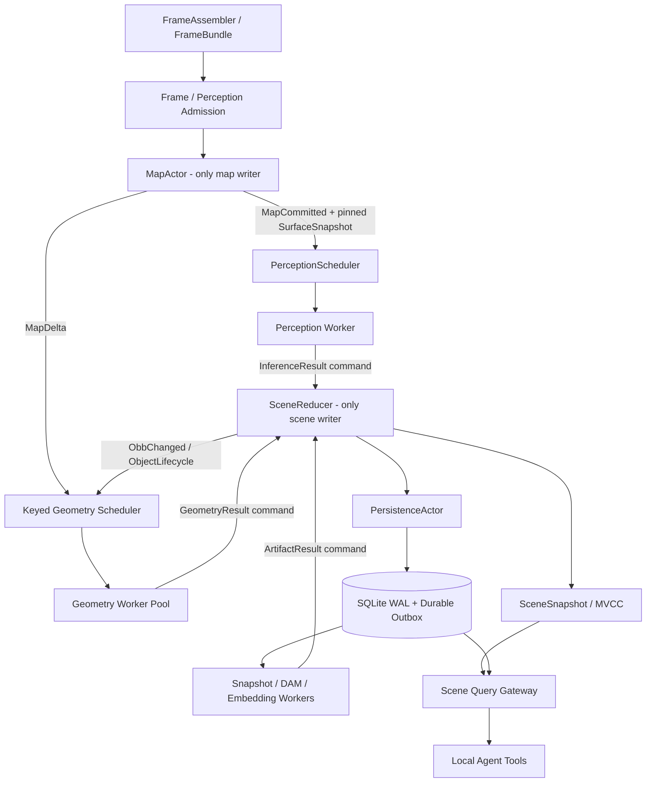

# Roomie 架构讨论收敛记录

> 状态：讨论已收敛，可以开始实现。
>
> 本文保留 `roomie_arch_opus.md` 与 `roomie_arch_sol.md` 的比较、裁决理由和待实验项。具体类型、PR 顺序、验收门槛以 [`roomie_arch_coding_plan.md`](roomie_arch_coding_plan.md) 为唯一执行依据；若旧方案中的建议与 coding plan 冲突，以 coding plan 为准。

## 0. 最终结论

两份方案在目标上高度一致，约八成内容可以直接合并。共同判断是：Roomie 的主要矛盾不是少几个线程或参数没有调好，而是缺少**版本化状态、局部失效、明确的调度语义和可恢复的异步制品链**。

双方方案合并为下面这条主线：

1. `MapActor` 成为 nvblox 唯一写者，主动产出带 revision 的 immutable `SurfaceSnapshot` 和 `MapDelta`，publisher 不再驱动 surface cache 更新。
2. perception response 先变成带完整 provenance 的 `ObservationEvent`；`SceneReducer` 是 track/object/relation current state 的唯一提交者。
3. geometry 从 `applyDetections()` 临界区移出，由 `MapDelta + ObbChanged` 局部触发；worker 在 pinned surface 上计算，reducer 用 dependency token/CAS 防止旧结果覆盖新状态。
4. 实时队列、可合并任务、可靠结果和 durable DAM/embedding 使用不同的 channel policy，不再统一 `pushDropOldest`。
5. snapshot 在线化并保留 Top-K 多视角证据；DAM 和 embedding 由内容哈希与组件 revision 驱动，进入持久 outbox。
6. objects、rooms、relations、descriptions 只有一个 canonical state；JSON 是兼容导出，不再是三份人工同步的事实数据库。
7. agent tool 从 live query gateway 读取，并在一次回答中 pin 同一个 scene/index revision。

以下架构契约已经拍板，不再作为实现期间的开放问题：

1. 写路径采用 **typed command + 单写者 `SceneReducer`**；event 只负责 committed notification。直接实现目标态，不建设长期存在的拆锁双写过渡架构。
2. 在线 perception 使用精确、immutable、**已经包含当前 FrameBundle** 的 surface snapshot。`freeze_tsdf_map=true` 是显式例外，必须写入 provenance。
3. current scene 以内存 revision 为准；SQLite 是异步 durable sidecar。允许异常重启丢失少量未持久化 revision，并公开 live/durable 两个 watermark。
4. perception 正常运行目标为 p99 10 s；已有场景少量对象的 snapshot/description/embedding 目标为 p95 约 10 s；新场景大量对象 burst 的语义制品目标为 p95 120 s。
5. DAM 默认依赖 identity、appearance、snapshot set 和模型/schema，不因普通 raw `obb_revision` 变化重算。
6. 初版保持单 in-flight + deadline admission。OBB refine、multi-in-flight、shared memory、ROI-only 和最终 Top-K/编码参数保留为有验收门槛的实验项。

因此已经没有阻止编码启动的产品或架构决策；剩余不确定性只影响优化幅度和实验 feature flag，不改变主干接口。

## 1. 双方已达成的共识

| 主题 | `roomie_arch_opus.md` 的主张 | `roomie_arch_sol.md` 的主张 | 合并结论 |
| --- | --- | --- | --- |
| 状态中心 | 不可变 `WorldState` + event bus | `SceneReducer` + MVCC `SceneSnapshot` | 逻辑上统一不可变世界状态；物理写入由单一 reducer 串行提交 |
| 地图 surface | dirty blocks、增量 `SurfaceBlockCache` | `MapActor`、block COW snapshot、map/surface revision | MapActor 主动增量提取并发布 immutable block snapshot |
| geometry | 脏块反查对象，独立 geometry thread | MapDelta + spatial index + keyed worker + CAS | geometry 退出 detection 路径，只处理受影响对象，结果做版本校验 |
| publisher | 不得触发 cache rebuild | 只读 immutable latest revision | publisher 是低优先级读者，永不阻塞地图/感知写路径 |
| 推理队列 | 反压、丢帧可观测、worker 自愈 | deadline、latest-per-camera、可靠 result、supervisor | admission、drop/backpressure 和 result reliability 分开定义 |
| snapshot | 在线化、Top-K、多质量指标 | SnapshotBank、视角多样性、AssetStore、provenance | 在线候选库 + primary/alternate + 有界资产生命周期 |
| DAM | 服务化、内容哈希、异步队列 | durable outbox、结构化 artifact、stale CAS | DAM 是可恢复的派生任务，不能直接改 current JSON |
| embedding | 持久化、按 text hash 增量 | 预热 worker、batch、index generation/freshness | 不在首次 tool call 中全量编码；对象级 upsert 和原子索引切换 |
| rooms/relations | 提升为 WorldState 一等公民 | canonical graph、字段 ownership、局部关系失效 | 去除顶层/嵌套双 object list，人工标注也提交 versioned patch |
| 可观测性 | drop、lock wait、revision lag | trace id、queue age、stale reject、artifact lag | 建立 frame → map → inference → scene → artifact 的端到端 trace |

### 1.1 对当前根因的共同事实判断

两份文档共同确认了以下代码事实：

- `RosIoThread::run()` 基本空等，实际拼帧发生在 ROS callbacks；RGB、depth、mask、TF 共用状态锁和 latest-slot 模型。
- mapping 与 detection 走独立队列，没有 map event-time watermark；检测使用哪一版地图由处理时序偶然决定。
- `PatchDepth.map_version` 进入 Python request，却没有随 `InferenceResponse` 回到实例融合层。
- nvblox dirty 后，`snapshotForView()` 和 `geometrySurfaceCache()` 不主动做周期重建；publisher 的 `debugSnapshot()` 反而可能触发重建。
- surface cache 全量扫描历史 TSDF；geometry evaluator 对每个对象扫描整份 surface，且 geometry mutation 阶段持有 `InstanceMapThread::mutex_`。
- geometry maintenance 由成功 inference response 顺带触发，地图变化本身不能独立推动对象重评。
- online mapping 不持续生成 snapshot；remaker 实际只在 load + freeze 工作流中启用。
- DAM、manual rooms、QA/embedding 分别依赖不同 JSON 或 JSON 副本；description 和 embedding 没有完整 provenance/失效协议。
- `ObjectSearchIndex` 首次 search 才加载模型和编码全体对象，运行中也不订阅 graph 更新。

这些事实足以支持大改，无需等所有实验项都拿到答案。

## 2. 两份方案各自补足了什么

### 2.1 Opus 方案值得吸收的部分

`roomie_arch_opus.md` 更接近一次性能与锁竞争 code review，几个贡献很具体：

- 明确指出 `evaluateGeometryAgainstSurface()` 的 `O(T × P)` 热点，以及 duplicate merge 的二次乃至重启循环开销。
- 指出现有 `SurfaceBlockCache` 已按 block 组织，因此 dirty-block 增量化不是从零设计，适合作为早期高收益改造。
- 将 object-block locality 同时用于 geometry revalidation 和 duplicate candidate narrowing，复用同一空间局部性。
- 提出 OBB geometry refine 的方向，使“几何—语义联合”不只停留在 geometry veto。
- 对 inference worker 的同步事务、永久熔断、publisher/backend 优先级倒置给出了直接代码锚点。
- 实施顺序强调先做局部、可度量、收益明确的 map/cache 修复，避免一开始陷入巨型 WorldState 重写。

### 2.2 Sol 方案值得吸收的部分

`roomie_arch_sol.md` 更接近状态一致性和异步系统设计，补齐了 Opus 中较弱的部分：

- 用 `map_epoch/map_revision/surface_revision/integrated_through_ns` 区分地图加载、积分和 surface 落后；单一 `geometry_version=map_version` 不够表达这些状态。
- 用 per-object component revision 避免“对象任意字段变化就取消所有慢任务”。
- 定义 TaskEnvelope、dependency token、at-least-once execution 和 reducer CAS，解决 late DAM/geometry/embedding 覆盖新状态的问题。
- 区分传感器帧、inference result、keyed geometry、durable artifact 和 publisher 的不同丢弃/反压策略。
- 增加 object alias/tombstone，处理 merge/delete 期间仍在运行的后台任务。
- 将 snapshot 升级为带证据和 provenance 的 AssetStore，而不只是一组 BMP 文件。
- 将 DAM 输出拆成结构化视觉事实、retrieval text 和 evidence refs，并用 transactional outbox 触发 embedding。
- 给 agent query 引入 `SceneReadToken(scene_revision, semantic_index_generation)`，保证多轮 tool call 的读一致性。
- 给出 SQLite WAL、checkpoint manifest、JSON 兼容导出和故障注入测试方案。

## 3. 最终合并架构

这里的“事件总线”需要限定语义：

- **Command**：请求改变 current state，只能进入 `SceneReducer`。
- **Committed Event**：reducer 成功提交 revision 后发布，供 publisher、geometry scheduler、artifact orchestrator 等订阅。
- **Task Result**：worker 返回的候选结果，必须再次作为 command 进入 reducer 做 dependency 校验。

禁止 event subscriber 任意回调并直接修改 `WorldState`。否则 event bus 会把现在的隐式线程耦合换成隐式回调耦合，也无法定义并发结果的提交顺序。

`WorldState` 和 `SceneSnapshot` 可以视为同一个逻辑概念：前者强调完整世界模型，后者强调某个可读取 revision。物理实现不应每次 deep-copy 全图，而应按 geometry/semantic/annotation/artifact 分片，用 immutable component + structural sharing/block COW。

在线因果屏障是拓扑的一部分：一个被 admission 为 perception candidate 的 `FrameBundle F`，只有在 MapActor 完成 F 的 depth/color integration 并发布与 F 对应的 pinned `SurfaceSnapshot S(F)` 后才能进入 PerceptionScheduler。不能用“当时最新 surface”代替精确的 frame-specific snapshot。

## 4. 曾有分歧及最终裁决

### 4.1 Event bus 与 SceneReducer

**Opus 倾向**：`WorldStateStore::commit(delta)` 加 subscription callback，事件替代独立定时器。

**Sol 倾向**：typed task/command 进入单写者 reducer，成功提交后再发布 immutable snapshot/event。

**裁决**：采用 Sol 的写入约束，保留 Opus 的事件驱动读侧。二者不是二选一：

- event bus 负责唤醒和 fan-out，不负责决定 current state。
- reducer 负责顺序、字段 ownership、alias 解析和 stale-result CAS。
- publisher/QA 只订阅 committed revision；geometry/DAM worker 永远不能直接 commit object。

理由是系统将出现大量晚到结果。若没有单一提交点，仅靠 component version 字段无法阻止两个 subscriber 以不同顺序覆盖状态。

### 4.2 拆锁还是单写者

**Opus 建议**：把 `InstanceMapThread::mutex_` 拆成 `tracks_mutex_` 和 `graph_mutex_`，geometry 进入独立线程。

**Sol 建议**：重计算全部移出 reducer；track/object current state 仍由单写者维护，对外发布 immutable snapshot。

**裁决**：直接实现单写者，不把 track 和 graph 变成两个可独立写的锁域。track promotion、merge、object node 和 relation patch 本来就是一个事务；简单拆锁会引入：

- track 已更新但 graph 尚未同步的可见窗口；
- snapshot reader 需要获取两把锁或接受混合版本；
- merge 与 geometry result 的锁顺序/对象生命周期竞态。

不采用“先拆锁、稳定后再上 reducer”的交付路线。实现可以在 feature branch 内分步搭骨架，但 PR-06/07 必须作为同一切换里程碑完成：reducer 成为唯一写者时，geometry 已经在 worker 中异步计算并通过 dependency token/CAS 回交，不能把重计算临时塞回 reducer。

### 4.3 Spatial index 采用反向 block map 还是 R-tree

**Opus 建议**：维护 `blocks_by_object_` 和 `objects_by_block_` 双向表。

**Sol 建议**：object expanded AABB R-tree，加 object 的 surface dependency blocks。

**初始实现裁决**：先用 object AABB spatial index 查询 dirty block 覆盖对象；geometry 计算完成后再记录精确 dependency blocks。原因是双向表在 OBB 每次变化时需要删除旧 block membership、插入新 membership，容易产生维护错误。对象量较小时，R-tree 或 block-AABB query 已足够。

如果 benchmark 表明 R-tree 查询或依赖判断仍是瓶颈，再增加 `objects_by_block_` 作为可重建 cache，而不是 authoritative state。duplicate merge 也只在空间相交候选中运行。

### 4.4 Geometry 是否反向 refine OBB

**Opus 建议**：框内近表面点 PCA/2D 主方向拟合，生成 `suggested_obb`，与 detector observation 加权融合。

**Sol 建议**：第一阶段保留现有 geometry score/verdict，只先解决局部化、版本和调度。

**裁决**：认可这是值得做的研究方向，但不进入第一轮默认写路径。PCA 面临以下风险：

- TSDF surface 可能只覆盖当前可见面，主方向偏向视角而非真实物体方向；
- 对称物体存在 90°/180° yaw 歧义；
- OBB 内可能包含墙、桌面或邻近物体，简单 PCA 会吸收背景；
- 当前 near-surface 点不是实例分割结果，几何边界并不等价于对象边界；
- map/surface 自身有延迟和融合噪声。

应先输出 shadow `suggested_obb`，记录与 detector OBB、后续高质量观测及人工标注的误差。只有在分类别 benchmark 上满足中心、尺寸、yaw 的回归门限，才允许按 label/geometry confidence 分级启用。

### 4.5 多 in-flight、batch 与固定 FPS

**Opus 建议**：Python worker 支持 N 个在途请求，用 backpressure 取代 wall-clock max FPS。

**Sol 建议**：deadline + latest-per-camera admission；是否 shared memory/multi-in-flight 先测量。

**裁决**：第一版保持单 in-flight，加入 10 s deadline admission 和显式 supersede。不要把“多 in-flight”当成天然更高 GPU 利用率。当前 Python 进程是同步 read → process → write；仅允许 C++ 多发请求不会产生并行，反而会在 pipe 或 worker 内积压旧帧。后续若要得到重叠收益，至少需要：

- 显式 `request_id`，不能只依赖 `time_ns + camera_id`；
- worker 内部 reader、preprocess、GPU dispatch、writer 分离，或真正 batch；
- bounded reorder buffer，因为 track aging 当前隐含 response 顺序；
- deadline/supersede，避免 GPU 计算已经失去实时价值的帧；
- 显存和 latency benchmark，确认 batch throughput 没有破坏 tail latency。

`max_inference_fps` 仍作为算力/热设计预算，不能只用 in-flight 上限替代。初版 admission 同时考虑 `max_fps budget + in_flight + oldest age + camera pose novelty + GPU lease`。

### 4.6 Shared memory 是否立即做

Opus 指出 pipe 传 960×960 图像有明显拷贝，方向正确；但“每帧约 2.7 MB”低估了 request：RGB 本身约 2.76 MB，若 mask 为 mono8，还需约 0.92 MB，另有 patch depth 和协议字段，主体约 3.69 MB。

**裁决**：shared memory 不进入第一轮实现。先加入 `serialize_ms/write_ms/read_ms/worker_queue_ms`；若 IPC 占 end-to-end p95 的显著比例，再独立引入 memfd/POSIX shm handle。shared memory 同时需要 ownership、超时回收和 worker crash GC，不能只改 wire payload。

### 4.7 Snapshot 存 ROI 还是共享完整帧

**Opus 建议**：只存 crop ROI，BMP 改 PNG/JPEG。

**Sol 建议**：content-addressed asset，candidate 可引用 frame ring，入选后 materialize crop/mask 并保留坐标变换。

**初始实现裁决**：不采用 ROI-only。先保存 content-addressed、去重的 lossless full-frame asset，并让对象 snapshot 保存 bbox/mask/crop transform 引用；Top-K 初始默认值为 3 且可配置。理由是：

- 同一帧有多个对象时，一张去重 full-frame + 多个 ROI ref 可能比多个 crop 更省空间；
- DAM bbox fallback、关系判断和 agent visual inspection 有时需要少量上下文；
- OCR/细纹理可能不适合有损 JPEG；PNG 对照片又可能过大。

后续通过实际 snapshot corpus 比较 full-frame dedup、PNG crop、JPEG/WebP crop 的总字节、DAM 质量和 decode latency，再决定是否改变物化格式。无论选择哪种编码，都必须保存 crop transform、mask source 和 source frame hash。

### 4.8 DAM 的依赖是否包含 `obb_revision`

Opus 的 `DescriptionRecord` 包含 `obb_revision`，并提出 snapshot hash 变化就重算 description。Sol 将 DAM 主要绑定到 identity/appearance revision。

**裁决**：默认不把每次 raw `obb_revision` 放进 DAM 失效键。DAM 描述的是视觉外观；对象 OBB 发生小幅融合变化，如果 snapshot/mask/crop 没变，不应重跑大模型。只有当 DAM prompt 确实消费 3D 尺寸/姿态，或 geometry 改变了 snapshot mask/crop 时，才把**量化后的 geometry signature**加入 dependency。

同理，primary snapshot 在语义等价视图之间切换也不应立即触发 DAM。应对 `snapshot_set_hash` 做质量迟滞与 debounce，并允许旧 description 作为 stale fallback。

### 4.9 SQLite 是热状态数据库还是 durable sidecar

Opus 只要求统一 WorldState；Sol 进一步建议 SQLite WAL 保存 scene history、artifacts 和 outbox。

**裁决**：SQLite 是异步 durable sidecar，不是 scene hot path 的同步提交门槛。

- Reducer 提交后立即发布 live immutable scene revision；PersistenceActor 按 revision 顺序批量写 SQLite WAL。
- 对外同时公开 `latest_scene_revision` 与 `durable_scene_revision`。异常重启允许丢失二者之间少量、尚未持久化的 revision，不声称 live revision 已经 durable。
- 初始默认 `flush_period_ms=1000`、soft undurable window 32 revisions、hard window 64 revisions；达到 hard limit 时暂停新的 perception admission 并形成可靠反压，防止丢失窗口无界增长。
- durable task/outbox、artifact metadata、alias/tombstone 和 checkpoint manifest 使用 SQLite；只有对应 scene revision 已 durable 的 artifact task 才能被 lease。
- 每一帧 map revision 不写 SQLite；map voxel/layer 仍由 nvblox checkpoint 管理，SQLite 只保存与 checkpoint 对齐的 manifest。

SQLite transaction benchmark 仍用于调优 batch、WAL checkpoint 和 flush period，但不再决定 canonical/sidecar 的架构身份。

### 4.10 实施顺序

Opus 倾向先做 dirty blocks/增量 cache，再做 observability 和 WorldState；Sol 倾向先补全因果字段/metrics，再修 map ownership 和 reducer。

**裁决**：实施顺序已经固化到 [`roomie_arch_coding_plan.md`](roomie_arch_coding_plan.md)，本节不再维护另一套可漂移的 PR 清单。其阶段依赖为：

1. Gate A：provenance、IPC v2、channel policy 与 baseline。
2. Gate B：MapActor surface ownership、dirty-block incremental snapshot、精确 include-current barrier。
3. Gate C：单写者 reducer、异步局部 geometry、SQLite durability watermark。
4. Gate D：在线 SnapshotBank、durable DAM、异步 embedding。
5. Gate E：live query/tools、canonical rooms/relations 和 schema v3。

OBB refine、multi-in-flight、shared memory 等不属于这条主干依赖链，只能在 baseline 后作为独立 shadow/feature-flag 实验。

## 5. 需要修正或收窄的事实表述

下面这些修正不推翻 Opus 的架构结论，但讨论时应使用更精确的说法。

### 5.1 Queue 数量

`RoomiePipeline` 顶层确实有 mapping、detection、inference response 三个 `ThreadSafeQueue`；`PythonInferenceBackend` 内部另有 request 和 response 两个同类队列。若讨论“系统内所有 drop-oldest channel”，应说至少五个，而不是三个。

### 5.2 `applyDetections()` 的锁范围

它不是从函数入口到出口全程持有 `InstanceMapThread::mutex_`：observation 构建、surface cache 获取和日志在锁外；association/merge/graph update 在第一段锁内，geometry evaluation/merge/graph update 在第二段锁内。真正的问题是最重的 `O(T × P)` geometry evaluation 位于第二段锁内，而不是字面上的“全函数加锁”。

### 5.3 `geometrySurfaceCache()` 不是无锁调用

nvblox backend 的该方法会获取 backend mutex，并调用 `ensureSurfaceCacheLocked(false)`；只是拿到的 `shared_ptr<const GeometrySurfaceCache>` 在返回后可被安全读取。值得保留的是 immutable shared ownership，不是“获取过程无锁”。

### 5.4 Geometry good 不是绝对永久冻结

`shouldEvaluateTrackGeometry()` 只有在 `kGood + OBB 未显著变化 + evaluation_map_version == surface_map_version` 时直接跳过。map version 变化后，如果 active track 仍有 recent high-quality evidence，仍可能重评；未来新的高质量 observation 也会重新打开条件。

更准确的批评是：**map 变化本身不足以触发 active object 重评，旧对象在没有 recent evidence 时可长期停留在旧 verdict**，而不是“一次 good 后永久冻结”。

### 5.5 `edgeCompletenessWeight` 已间接进入 snapshot 分数

`observationBboxQuality()` 计算 `confidence × edgeCompletenessWeight × distanceQualityWeight`；frozen snapshot candidate 接收 `observation.bbox_quality`，`candidateQuality()` 再乘 image position/size reward。因此 edge completeness 已间接传入，不能列为完全缺失。

仍然成立的问题是：snapshot 层拿不到 edge、distance 等分项，无法解释分数，也没有 blur、exposure、mask purity、view diversity 等新证据。

### 5.6 周期是配置值，不是固定系统事实

5 s surface rebuild 和 5 s publish 是当前主要配置中的默认值，其他配置已有 1 s。架构问题是多个独立 period 缺少因果关系，而不是恰好固定为 5 s。

### 5.7 “四趟离线”是典型工作流，不是硬性状态机

snapshot remake 的确依赖 frozen workflow，DAM 和 room UI 也都是独立离线程序；但 DAM、manual room 并非 pipeline 强制必经步骤。宜描述为“当前完整语义图通常需要多趟人工编排”，而不是系统必然执行四轮。

### 5.8 `waitPopFor()` 不是忙轮询

它内部使用 condition variable，数据到达会立即唤醒；50 ms timeout 主要用于检查 stop/status。事件驱动可以去掉多处独立 timer 和 timeout wakeup，但“消掉五处轮询”不是主要性能收益。真正的调度问题是 policy、deadline、因果关系和不可恢复 drop。

### 5.9 多 in-flight 需要显式 request id

`time_ns + camera_id` 当前可用于 debug frame lookup，但不应作为新协议的唯一关联键。重复时间戳、重放、重试、同帧多模型任务和 map epoch 切换都可能冲突，应增加显式 `request_id/task_id`。

## 6. 已关闭的验证项与剩余实验

### 6.1 已关闭，不再阻塞接口设计

- **dirty-block 公共 API 已确认存在。** 本地 nvblox 的 `ProjectiveTsdfIntegrator::integrateFrame(..., updated_blocks)` 与 `ProjectiveAppearanceIntegrator<ColorLayer>::integrateFrame(..., updated_blocks)` 都可直接返回更新块；`Mapper` 也公开 TSDF/color integrator 与 layer 的非 const accessor。不需要访问 protected `getBlocksToUpdate()`，也不消费 `BlocksToUpdateTracker`。
- **direct integrator 的风险是 wrapper side effect，不是 dirty set 可得性。** 实现必须复用同一 CUDA stream、补齐 layer `updateGpuHash()`，并用回归测试确认 depth preprocessing、last posed depth 和内部 tracker 等当前未依赖的行为没有造成回归。
- **causal map policy 已确定。** 在线 detection 使用精确“含当前帧”snapshot；frozen map 是带 provenance 的显式例外，不再做 previous-frame A/B 来决定架构契约。
- **持久性身份已确定。** SQLite 是异步 sidecar；性能测试只调参数，不再决定是否同步 canonical。

### 6.2 仍需数据决定，但不阻塞主干实现

| 实验项 | 为什么仍需实验 | 默认行为 | 改变默认的通过条件 |
| --- | --- | --- | --- |
| incremental surface cache 的真实收益 | 高运动或小地图时 dirty blocks 可能接近全图 | 实现 dirty-block COW，并保留 full fallback | 与 full rebuild 等价，且 surface lag/map lock hold 明显下降 |
| R-tree 与 `objects_by_block_` | 对象数、OBB 更新率和 dirty block 密度决定维护成本 | AABB spatial index + result dependency blocks | 反向 block cache 在真实 bag 上稳定降低总 CPU，且一致性测试通过 |
| PCA/局部 surface refine OBB | 部分可见面、背景污染、对称性会偏置 | 仅 shadow 输出，不写回 | 分类别 center/extent/yaw 改善且坏例率低于门限 |
| N in-flight 或 micro-batch | 当前 worker 同步，显存和 tail latency 未知 | 单 in-flight + deadline admission | throughput 提升且 perception p99、stale ratio、显存均达标 |
| shared memory | 模型计算可能远大于 IPC 拷贝 | pipe IPC + 分段 timing | IPC 占 p95 达到预设阈值，prototype 有稳定净收益且 crash GC 完整 |
| patch-depth occlusion 评分 | 60×60 投影粗，缺少稳定实例深度证据 | 不作为 snapshot hard gate | 人工遮挡集上排序稳定增益，且不误伤细小物体 |
| Top-K、视角阈值和编码 | 取决于 DAM 收益、磁盘和 decode 成本 | `K=3` 可配置；去重 lossless full-frame + ROI refs | corpus 上找到质量/容量拐点并满足 asset budget |
| DAM 结构化 schema | 当前接口只返回文本 | structured parse + repair + unstructured fallback | schema success、事实正确率和延迟达到设定门限 |
| 单 GPU 模型调度 | 驻留显存、切换成本和抢占粒度未知 | perception 最高优先级；artifact quiet-window/lease | 不破坏 perception 10 s SLO，并满足 interactive/bulk 制品目标 |
| visibility-aware aging | 视锥容易，真实遮挡/free-space 较难 | 先做 in-frustum 与 scheduler-skipped 保护 | 降低误 inactive，且不会让消失对象长期 active |

这些实验必须建立在统一 provenance 与真实 bag baseline 上，以独立 feature flag/shadow output 进行；实验失败不应迫使 reducer、revision 或 outbox 接口返工。

## 7. 原开放问题的关闭答案

1. 所有 current-state 写入由 `SceneReducer` 严格串行提交；subscriber 不允许嵌套写 current state，只能发新 command。
2. immutable scene 使用 component-level COW/structural sharing；surface 使用 block COW，不做每 revision 全图 deep copy。
3. dirty blocks 直接从 TSDF/color integrator 的 `updated_blocks` 出参取得，不读取 Mapper 的共享 tracker。
4. 不建立 `tracks_mutex_` 与 `graph_mutex_` 两个 authoritative 写域；promotion/merge/object/relation 在 reducer 内作为一个 revision 提交。
5. 初版不实现多 in-flight；未来并行形态由 CPU/GPU timeline 和 tail-latency benchmark 决定。
6. OBB refine 只做 shadow、按类别验收；未经数据证明不进入默认融合写路径。
7. DAM dependency 默认不含 raw `obb_revision`，只在 prompt 真正消费 3D 几何时加入量化 geometry signature。
8. snapshot 初版保留去重 full-frame 上下文与 ROI/mask refs，不采用不可逆的 ROI-only 设计。
9. event bus 的主要目标是明确 command/event/result 语义和减少隐式定时耦合，不把消除 CV timeout wakeup 作为核心性能收益。

## 8. 生效中的联合 ADR

1. **ADR-001：MapActor 是 map/surface 唯一写者。** publisher 只读 immutable snapshot，不触发 cache rebuild。
2. **ADR-002：SceneReducer 是 current scene 唯一写者。** 所有 worker 只返回 candidate result。
3. **ADR-003：在线 perception 使用含当前帧的精确 surface。** frame-specific snapshot 必须 immutable；frozen mode 显式标注例外。
4. **ADR-004：所有派生产物携带 provenance 与最小 dependency token。** map reset 使用 epoch，merge/delete 使用 alias/tombstone，提交使用 CAS。
5. **ADR-005：channel policy 按业务语义区分。** inference result 不静默丢失；输入 supersede、backpressure 和 drop 都有 reason/metric。
6. **ADR-006：geometry 不在 scene-state 临界区做全图扫描。** `MapDelta + ObbChanged` 局部调度，worker pin immutable input。
7. **ADR-007：snapshot 在线化并支持多证据。** 初始 Top-K 为 3 且可配置，资产 content-addressed 并带证据来源。
8. **ADR-008：SQLite 是异步 durable sidecar。** 公开 live/durable watermark，允许 bounded undurable window，map 本体归 nvblox checkpoint。
9. **ADR-009：DAM/embedding 是 durable 派生任务。** 不在实时路径或首次 tool call 中重算，晚到结果经 reducer 校验。
10. **ADR-010：canonical scene 只有一份。** objects、rooms、relations、descriptions 由 scene state 管理，JSON 只是兼容导入导出。
11. **ADR-011：一次 agent answer pin 一致读版本。** query 使用 scene revision 与 semantic-index generation，并返回 freshness/provenance。
12. **ADR-012：调度服从已确认 SLO。** perception p99 10 s；少量更新制品 p95 约 10 s；新对象 burst 制品 p95 120 s。artifact 逾期记录 violation，不因到期本身丢弃。

## 9. 实现交接

本讨论记录不再维护独立的“最小闭环”或替代实施顺序。实现者应直接执行 [`roomie_arch_coding_plan.md`](roomie_arch_coding_plan.md) 中的 PR-01～PR-13 和 Gate A～E；所有 PR 共享同一套 ID、revision、command、dependency token、outbox 与 freshness 契约。

当前没有需要用户继续拍板的阻塞项。若实现中出现会改变模型输入分布、外部数据契约或允许丢失窗口的新问题，再新增 ADR 并请求决策；性能参数和内部文件拆分由实现者依据基准自主决定。

最终共识可以概括为一句话：**Opus 提出的“局部化和性能关键路径”与 Sol 提出的“版本化提交和持久异步任务”不是竞争方案；前者决定系统算得动，后者保证系统算晚了、算重了或进程重启后仍然算得对。**
