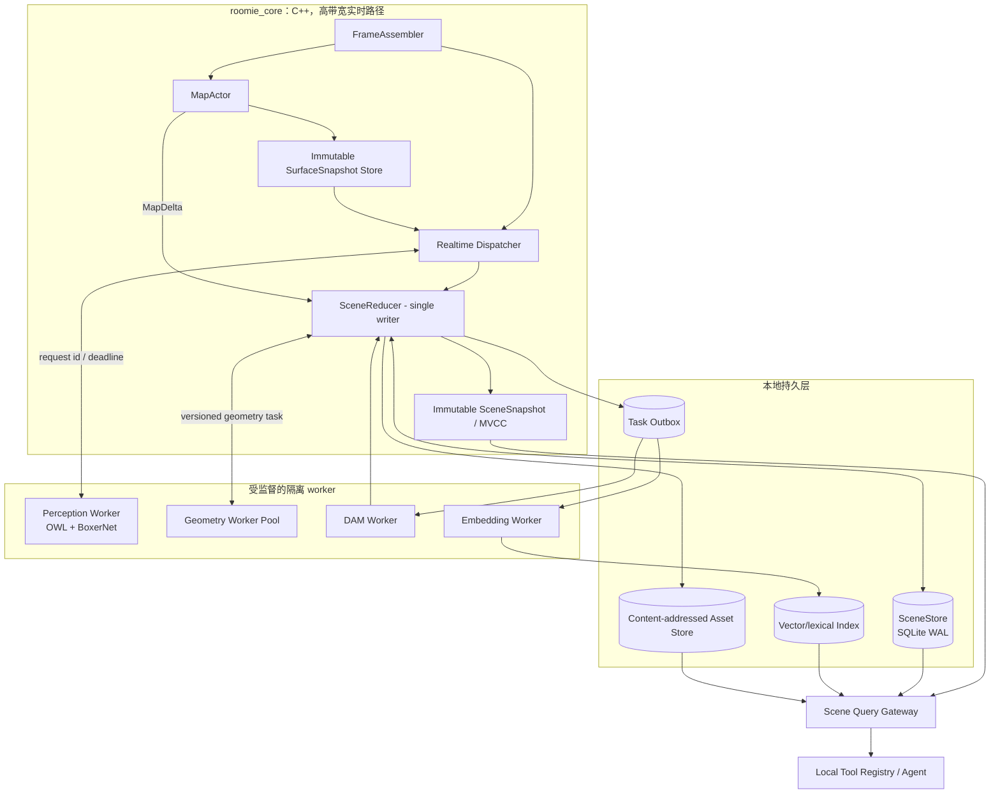

# Roomie 架构重构方案：版本化实时场景记忆与异步语义制品流水线

## 0. 结论先行

Roomie 当前的问题并不主要是“线程还不够多”，而是系统缺少三个架构概念：

1. **因果版本**：一个检测、几何检查、snapshot、DAM 描述或 embedding，究竟基于哪一帧、哪一版地图、哪一版对象和哪组图像生成，目前没有贯穿全链路的依赖标识。
2. **统一提交点**：地图、track、object graph、手工 room、description 和 embedding 分散在内存对象及多个 JSON 副本中，没有一个负责校验旧结果并原子发布新 revision 的场景状态提交者。
3. **区分实时数据与延迟任务的调度语义**：传感器帧可以有条件丢弃，已经完成 GPU 推理的结果不应静默丢弃，DAM/embedding 则需要可恢复、可合并、可延后执行。当前它们基本都被抽象成同一种“有界队列 + drop oldest”。

建议将 Roomie 重构为一个**版本化场景内核**：C++ 实时核心维护地图和对象状态，`SceneReducer` 作为单写者提交轻量 patch；所有耗时计算在不可变输入上并行执行，返回时通过 dependency token 做 compare-and-swap；snapshot、DAM、embedding 进入持久化后台任务平面；本地 agent tool 从同一个带 revision 的查询服务读取，而不再启动时加载某个静态 JSON。

这套方案的关键效果是：

- 地图持续积分时，几何验证能由 map delta 主动、增量地触发，而不是等待下一次 inference response。
- 慢任务可以晚到，但旧结果不能覆盖新状态；系统可以明确报告“语义尚未更新”，而不是悄悄使用过期描述。
- agent 的多次 tool call 可以读取同一个 scene revision，避免一次回答中前后看到不同对象集合。
- snapshot、DAM、embedding 的失败和进程重启不会丢任务，也不会阻塞实时建图。

## 1. 对现有实现的理解

当前主链路可以概括为：

```mermaid
flowchart LR
  ROS[ROS MultiThreadedExecutor callbacks] -->|latest RGB/depth/mask/TF| IO[RosIoThread state]
  IO --> MQ[mapping_queue]
  IO --> DQ[detection_queue]
  MQ --> MAP[MapThread / MapBackend]
  DQ --> BRIDGE[DetectionBridgeThread]
  MAP -->|synchronous surface snapshot| BRIDGE
  BRIDGE --> IRQ[inference request queue]
  IRQ --> PY[Python OWL + BoxerNet process]
  PY --> IR[response queues]
  IR --> INST[InstanceMapThread]
  MAP -->|surface cache| INST
  INST --> GRAPH[ObjectGraph]
  MAP --> PUB[PublisherPersistenceThread]
  GRAPH --> PUB
  PUB --> JSON[DSG JSON + snapshots]
  JSON --> DAM[offline DAM script]
  DAM --> DJSON[dam_described JSON copy]
  DJSON --> QA[GraphStore + lazy ObjectSearchIndex]
  QA --> AGENT[Gemini local tool loop]
```



已有实现有不少正确的基础：高频地图和实例状态由 C++ 持有；Python 推理被隔离成子进程；队列有容量上限；对象已经有 `obb_revision`、`geometry_evaluation_map_version`；JSON 写入使用临时文件后 rename；snapshot 替换有迟滞阈值。这些都可以保留并演化。

但从代码实际行为看，下面的问题会限制“几何—语义联合实时更新”和异步任务可靠性。

### 1.1 数据同步和队列没有表达业务语义

- `RosIoThread::makeFramesLocked()` 使用每种输入的 latest slot 拼帧。它能检查时间差，却没有显式的 frame bundle、输入缺失原因、事件时间 watermark 或校准版本；ROS callback 还会在锁内转换、复制整张图像。
- `ThreadSafeQueue::pushDropOldest()` 被 mapping、detection、inference request、inference response 共用。队列满时只删除旧元素，调用方仍得到 `true`，没有 dropped/superseded 原因和队列等待时间。
- mapping 和 detection 从同一 RGB 时间戳进入两个独立队列。检测投影时无法要求地图“已经处理到这帧”或“只能使用不晚于这帧的地图”，因此其几何输入可能落后，也可能在积压时混入事件时间更晚的地图状态。
- `InferenceRequest` 携带 `PatchDepth.map_version`，Python worker 也会读到它，但 response 协议没有把它送回 `InferenceResponse`。实例融合层最终只知道时间戳和 camera id，不知道该检测基于哪一版 surface。

### 1.2 地图 surface 的新鲜度由旁路消费者间接驱动

- nvblox backend 在 `snapshotForView()` 和 `geometrySurfaceCache()` 中调用 `ensureSurfaceCacheLocked(false)`，dirty cache 不会在这两条关键路径主动重建。
- 允许周期重建的是 `snapshot()`；目前主要由 `PublisherPersistenceThread::run()` 的 `debugSnapshot()` 触发。因此检测和几何验证所见 surface 的新鲜度，间接依赖 publish period 和是否恰好发生过发布。
- 地图积分、全图 surface cache 重建、视锥筛选和大 vector 拷贝共用 backend mutex。一次全图提取会暂停积分，检测投影也会和积分互相阻塞。
- surface 每次全量扫描构建，几何检查又在 `evaluateGeometryAgainstSurface()` 中对每个待检查对象扫描整份 surface，复杂度近似为 `对象数 × surface 点数`，且后半段在 `InstanceMapThread` mutex 内执行。

### 1.3 几何维护被绑定在语义推理响应上

- `InstanceMapThread::applyDetections()` 只有收到成功 inference response 才判断是否运行 geometry maintenance。地图更新、加载新地图、surface cache 更新本身不会触发对象失效或重评。
- geometry period 使用 response 的传感器时间，而不是独立调度时钟；检测禁用、Python worker 故障或没有新响应时，几何状态也停止演化。
- 一个 active object 即使 `geometry_evaluation_map_version` 落后，也仍可能因为缺少“最近高质量 observation”而不重评。
- track 融合、duplicate merge、全图几何检查、对象删除和 graph 更新由同一个线程串行完成。耗时几何计算会阻塞新的 observation 提交和所有 graph snapshot reader。
- track aging 按收到的全局 inference response 计 `missed_count`，没有先判断该对象是否应当出现在当前相机视锥及是否被遮挡；以后扩展多相机时这个语义会更加脆弱。

### 1.4 ObjectGraph 是可用的内存投影，但还不是场景状态内核

- `ObjectGraph` 没有全局 graph revision，也没有对象级 semantic/snapshot/description revision；只有部分几何 revision。
- `description`、几何字段、人工房间标注没有明确字段所有者。当前 `updateNodeFromTrack()` 依靠“description 非空则保留”避免覆盖，这不能替代正式的 patch/ownership 协议。
- object merge 直接删除 loser，没有 alias/tombstone。已经排队的 DAM 或 embedding 任务可能继续引用被删除 id。
- `roomie_manual_scene_graph` 同时保存顶层 `objects` 和嵌套 `object_graph.objects`。离线 room UI、C++ 保存逻辑和 DAM 脚本分别做部分同步，存在两个事实来源。
- DSG 主要靠手动 save service 导出。service callback 会同步准备 snapshot、复制图片并写 JSON；JSON 是交换文件，也是事实数据库，无法保存未完成任务、重试状态和完整 revision 历史。

### 1.5 Snapshot 目前是特殊模式下的单帧替换器

- `ObjectSnapshotRemaker` 只有在 `load_scene_graph && freeze_instances && snapshot_remake_enabled` 时真正启用；在线新建对象没有持续的 snapshot candidate bank。
- 候选质量主要是 bbox observation quality、面积和居中度，没有显式评估模糊、遮挡、截断、mask 纯度、视角、曝光、姿态一致性和多视角互补性。
- 每个对象只保留一个 best ref。单视角容易看不到部件，也无法让 DAM 对多帧证据做一致性判断。
- 改善帧先以完整 960×960 BMP 写入 staging，保存 DSG 时再复制和重新编号；没有内容寻址、引用计数、生命周期和崩溃恢复。
- DAM 的 mask 是 bbox 矩形，不是实例 mask；背景物体会直接污染详细描述。

### 1.6 DAM、embedding 和 tool 层是静态离线链

- `roomie_dsg_dam_describe.py` 串行遍历对象，直接生成一段自由文本并写入新的 JSON 副本。任务没有对象/snapshot revision、model version、prompt version、重试记录或 stale-result 检查。
- `ObjectSearchIndex` 在第一次 `search_objects` 时才加载 SentenceTransformer，并一次性编码所有对象文本。模型冷启动和全量 embedding 发生在 agent tool call 的同步路径中。
- embedding 只存在进程内 numpy 数组，没有持久缓存、对象级 upsert、删除、model migration 或图更新后的失效机制。
- `GraphStore` 在 QA 进程启动时读取固定 JSON；运行中的 Roomie 即使产生新对象或新描述，tool 也不可见。
- Gemini loop 中 tool 本身同步执行。同步返回是合理的，但 tool 内不应临时承担模型加载、全量 embedding 等不可预测的重工作业。

## 2. 目标架构

建议采用“**一个实时场景内核 + 一个持久任务平面 + 多个受监督模型 worker + 一个版本化查询面**”的结构，而不是把所有模块都拆成 ROS node。



推荐的进程边界如下：

- **`roomie_core`（C++）**：ROS 输入、地图单写者、不可变 surface 发布、实时调度、track/graph reducer、ROS 可视化。RGB-D 等高带宽数据尽量不经过 DDS 二次转发。
- **`roomie_perception_worker`（Python）**：OWL/BoxerNet，保留进程隔离，但升级 IPC 协议和健康管理。
- **`roomie_artifact_worker`（Python，可按模型再拆）**：DAM 和 embedding 消费持久任务。单 GPU 时由统一 GPU dispatcher 决定何时发 DAM；embedding 默认可放 CPU。
- **`roomie_query_gateway`（可先放 Python）**：提供本地 tool adapter、版本化 scene read、semantic search 和 snapshot asset 读取。它不直接修改 scene state。

这不是要求引入 Kafka、Celery 或分布式系统。单机环境用 C++ channel、Unix domain socket/共享内存和 SQLite WAL 已足够；重要的是补齐语义，而不是增加基础设施数量。

## 3. 统一的数据与版本契约

### 3.1 FrameBundle：一次同步，处处引用

将当前 MappingFrame/DetectionFrame 的重复大对象升级为不可变 `FrameBundle`：

```text
FrameBundle {
  frame_id: UUID/uint64
  camera_id
  sensor_time_ns
  ingest_time_monotonic_ns
  rgb_ref, depth_ref, robot_mask_ref
  intrinsics
  calibration_revision
  pose: T_world_camera
  pose_revision / tf_quality
  sync_deltas_ns
}
```

RGB、depth、mask 使用共享 immutable buffer；mapping 和 detection 只持有引用。FrameAssembler 用按时间戳排序的小窗口做同步，明确产生 `FrameReady` 或 `FrameDropped(reason)`，维护每个 camera 的 event-time watermark。不要在持有同步状态锁时做整图格式转换；转换放入预处理 worker 或使用 ROS loaned message 能力。

### 3.2 地图版本必须包含 epoch、revision 和时间水位

仅有递增 `map_version` 不足以表达加载另一张地图、回滚 checkpoint 或 surface 落后。建议使用：

```text
MapVersion {
  map_epoch_id          // 新建、load、reset 时变化
  map_revision          // 每次成功积分/地图事务递增
  integrated_through_ns // 已按事件时间处理到哪里
  surface_revision      // 已提取可查询 surface 对应的 map revision
  calibration_revision
}
```

所有 projection/inference observation 都保存完整 `MapVersion`。如果设计要求当前帧进入地图后再检测，则 dispatcher 等待 `integrated_through_ns >= frame.sensor_time_ns`；如果要求严格避免当前帧泄漏，则显式 pin `surface_at_or_before(frame_time)`。超出 latency budget 时按配置选择跳过或使用已知较旧 surface，并把降级写进 provenance，不能隐式取“此刻最新”。

### 3.3 场景 revision 与组件 revision

`SceneReducer` 每次成功提交产生递增 `scene_revision`，同时对象按组件维护 revision：

```text
ObjectState {
  object_id, identity_revision, lifecycle_state
  geometry_revision       // OBB、geometry status、map coupling
  appearance_revision     // snapshot candidate/set
  semantic_revision       // detector label distribution、DAM artifact
  relation_revision
  current_description_id
  current_snapshot_set_id
  active, publishable
}
```

不应让任意 graph 变化都取消所有后台任务。每个任务只声明真正依赖的 revision：geometry validation 依赖 `geometry_revision + surface_revision`；DAM 依赖 `identity/appearance revision + prompt/model version`；embedding 依赖规范化 semantic document 的 hash。这样对象位置发生几毫米变化时不会无意义地重跑 DAM。

### 3.4 TaskEnvelope 和 stale-result 提交

实时任务和后台任务使用同一种 envelope，但可以落在不同队列：

```text
TaskEnvelope {
  task_id, task_kind, key              // key 例如 object_id 或 camera_id
  event_time_ns, enqueue_monotonic_ns
  priority, deadline_ns, attempt
  input_refs
  depends_on { map, surface, object component revisions, content hashes }
  trace_id
}

TaskResult {
  task_id, status, depends_on
  output_ref / output_hash
  timings, worker_version, error
}
```

worker 只计算，不能直接改 current object。结果返回 `SceneReducer` 后执行：

1. 解析 object alias；若对象已永久删除则记为 superseded。
2. 校验相关 component revision/hash。
3. 仍然适用则原子提交 patch 并增加 scene revision。
4. 已过期则保存审计结果但不挂到 current state，必要时合并/重排新任务。

执行层采用 **at-least-once + 幂等 effect**，不要试图宣称跨进程 exactly-once。`task_id`/唯一 dependency key 和 reducer CAS 足以避免重复副作用。

### 3.5 对象 merge、delete 和人工字段所有权

- object id 永不复用。merge 写入 `ObjectAlias(loser -> canonical, merge_revision)`；delete 写 tombstone。晚到任务可以重定向或明确失效。
- geometry producer 只能提交 geometry patch；DAM 只能提交 visual semantic artifact；human annotation 只能提交受保护的 label/room patch。Reducer 在 schema 层校验所有权。
- 将 `detector_label_distribution`、`visual_description`、`human_name`、`agent_summary` 分字段存储，不再把所有语义压进一个容易互相覆盖的 `description` 字符串。

## 4. 几何—语义联合实时更新

### 4.1 MapActor 和不可变 surface

`MapActor` 是 nvblox 的唯一写者。每次积分后输出：

```text
MapCommitted(map_version, changed_block_ids, removed_block_ids)
SurfaceCommitted(surface_revision, immutable_block_refs)
```

surface 应按 changed block 增量重建，而不是等待 publisher 全图扫描。对外发布 block-level copy-on-write 的 `shared_ptr<const SurfaceSnapshot>`：projection、geometry worker 和 publisher pin 一个 snapshot 后即可无锁读取；MapActor 只替换变化 block 的指针。视锥筛选只遍历 block AABB，避免复制全图点云后再处理。

如果 nvblox API 暂时难以做到同 revision 增量提取，第一步也应把“cache rebuild 调度”移到 MapActor，并明确发布 `surface_revision < map_revision` 的 lag；绝不能再由 publisher 偶然驱动新鲜度。

### 4.2 MapDelta 驱动局部几何失效

Scene 内维护 object expanded AABB 的 R-tree，以及 object 与 surface block 的依赖集合。收到 `MapDelta` 后：

1. 查询与 changed blocks 相交的 objects。
2. 将这些对象标记为 `geometry_validation_pending`，但不立刻清空上一次 good 结果。
3. keyed geometry queue 对同一 object 只保留最新 dependency 的任务。
4. geometry worker 在 pin 的 surface snapshot 上，用 block spatial index 只扫描对象附近点。
5. 结果 CAS 提交；若计算期间 map 又前进，但中间 delta 与该对象依赖区域不相交，可以安全接受，否则重排。

这使计算量从“周期性 `所有对象 × 全图点`”转为“变化区域中的对象 × 局部 blocks”，并让地图变化在没有新检测时也能修正 scene graph。

### 4.3 Observation log 与确定性 SceneReducer

Perception response 先转为 immutable `ObservationEvent`，包含 frame、pose、surface、model 和原始 score provenance。Reducer 只做轻量工作：

- 有界乱序窗口内按 event time 排序；超晚 observation 按策略标记或拒绝。
- 数据关联、track lifecycle、promotion、merge 和 graph patch。
- 产生后续 geometry/snapshot/description invalidation 事件。

重计算 geometry、图像编码、DAM 和 embedding 均不得在 reducer mutex 内执行。Observation event 可按保留策略写入 SQLite，支持离线 deterministic replay；这会显著降低以后调 association 阈值时的验证成本。

track aging 应改为 visibility-aware：只有在相机视锥内、预计可见且当前 observation 没有匹配时才累计 miss；遮挡、相机未覆盖和 inference 被调度器跳过不能等价为“对象消失”。

### 4.4 关系也按局部 invalidation 更新

room containment、near/on/inside 等关系是派生状态，不应作为永远不变的手工 JSON。对象 geometry revision 或 room annotation revision 改变时，只重算其邻域关系。人工 room 是 canonical graph 中带 `source=human`、可锁定的 node；对象移动后 containment relation 自动更新，避免顶层和嵌套 object 列表分叉。

## 5. 调度与背压

### 5.1 不同工作负载必须使用不同 channel policy

| 工作负载 | 建议策略 | 满载时行为 |
| --- | --- | --- |
| RGB-D 同步输入 | 按 camera 的时间窗口 | 丢不完整/过期 bundle，记录原因并推进 watermark |
| 地图积分 | sensor-time FIFO，有显式采样策略 | 入队前决定 skip；一旦接收不可静默丢弃 |
| detection request | deadline + latest-per-camera | GPU 开始计算前可 supersede；过 deadline 不浪费推理 |
| inference result -> reducer | reliable bounded queue | 不 drop；向 dispatcher 反压，必要时暂停发新 request |
| geometry validation | latest-per-object keyed coalescing | 取消/替换旧 dependency 任务 |
| snapshot materialize | keyed soft-real-time | 保留高分候选引用，低分任务可 supersede |
| DAM | durable priority queue | 延迟、重试、退避，不影响实时路径 |
| embedding | durable keyed batch queue | 按 document hash 合并，批量执行 |
| ROS publish | latest scene snapshot | 慢订阅者只看较新 revision |
| checkpoint/export | pin revision 后后台执行 | 合并重复请求，报告完成 revision |

所有 channel 至少暴露 depth、oldest age、enqueue/dequeue rate、drop/supersede/backpressure count。`pushDropOldest()` 这种无法区分“成功入队”和“挤掉了别人”的返回值应淘汰。

### 5.2 实时与后台双调度平面

- **实时平面**：map integration、projection、perception、observation commit；有 deadline 和最大排队年龄。
- **后台平面**：geometry maintenance、snapshot 编码、DAM、embedding、checkpoint；有 dependency、优先级、重试和持久状态。

geometry 对当前交互很重要，可以处于二者之间：新对象第一次确认给较高优先级，旧对象因远处 map delta 重评则走后台 lane。

### 5.3 单 GPU 资源仲裁

当前 Boxer、DAM、SentenceTransformer 都可能独立占 CUDA。建议由 `GpuDispatcher` 发放 GPU lease：

- perception request 优先，按 deadline dispatch。
- DAM 只在 perception queue 空闲或 GPU utilization 低于阈值时开始新样本；已开始的单次生成通常不做危险的硬抢占。
- embedding 默认 CPU；积压很大且 GPU 有空闲窗口时再批量迁移。
- 每个 worker 上报预计显存、模型加载状态、batch 能力和心跳。若频繁切换模型代价高，可配置时间片窗口，而不是让三个进程争抢到 OOM。

### 5.4 Worker IPC 与监督

现有 stdin/stdout 二进制协议可以渐进升级，不必立即换框架，但至少增加：protocol version、request id、dependency token、deadline、cancel/supersede、response status、heartbeat、read/write timeout 和 worker build/model id。Supervisor 对 worker 做 restart/backoff/circuit breaker；三次 IPC 失败后不应永久禁用到整个 pipeline 重启。

图像 payload 可以先继续走 pipe；确认它成为瓶颈后，再换 memfd/shared-memory handle。不要把优化顺序倒过来。

## 6. Snapshot：从“单张最佳图”升级为证据库

### 6.1 在线产生候选

对象完成 association 后，不论是 live mapping 还是 frozen map，都可产生 `SnapshotCandidate`：

```text
SnapshotCandidate {
  candidate_id, object_id, object_identity_revision
  frame_id, camera_id, sensor_time_ns
  image_asset_ref, crop_transform
  bbox, instance_mask_ref?, depth/pose refs
  scores { association, pixels, center_margin, blur, exposure,
           truncation, occlusion, mask_purity, geometry_consistency }
  viewpoint { distance, azimuth, elevation }
}
```

先做硬门限，再做排序。bbox 面积和居中度可以保留，但不能作为完整质量定义。blur 可用 Laplacian variance，曝光可用直方图，截断看边缘距离，遮挡/mask purity 优先使用 detector/segmenter mask；暂时只有 bbox 时必须把 `mask_source=bbox_fallback` 写入 provenance。

### 6.2 保留 Top-K 多视角，而非一个 scalar best

每个对象建议保留 3～5 个候选：一个 primary，加若干能覆盖不同 azimuth/elevation、尺度和可见部件的 alternate。选择时使用“质量 + 新视角增益”的 Pareto/分桶策略，并保留替换迟滞，避免每帧抖动。DAM 使用多视角做交叉验证，`inspect_snapshot` tool 也可以按需查看 alternate。

tentative track 的候选先挂在 track 上；promotion 后迁移到 object，merge 时通过 alias 合并并重新选择。对象外观或 snapshot set 改变才增加 `appearance_revision`，不因普通 geometry 小变动重跑 DAM。

### 6.3 AssetStore 和生命周期

- 图片、crop、mask 使用 SHA-256 内容寻址，metadata 记录原图尺寸、crop 坐标变换和编码。
- 候选阶段可依赖有 TTL 的压缩 frame ring；入选后立即 materialize 为独立资产，不能长期依赖一张可能被淘汰的内存图。
- SQLite 保存 asset 引用计数；checkpoint/DAM/tool 都通过 asset id 访问。GC 只删除无引用且超过 grace period 的资产。
- 导出 JSON 时只生成兼容 URI，不再复制并重编号整个 staging 集合。

## 7. DAM：结构化、可追踪、可延迟

### 7.1 任务触发

DAM 不应由人工运行脚本扫描整个 JSON。`SnapshotSetCommitted` 后，ArtifactOrchestrator 做 debounce：对象达到 stable、primary snapshot 达到阈值且一段时间没有更优候选时，创建唯一键为下列内容的 durable job：

```text
(object_id, identity_revision, appearance_revision,
 snapshot_set_hash, dam_model_id, prompt_hash, output_schema_version)
```

同一对象的新 job 会 supersede 未开始的旧 job；运行中的旧 job可以完成，但 CAS 时不会覆盖新 revision。失败按错误类型重试和指数退避；无 snapshot/质量不足是 `insufficient_evidence`，不是无限重试错误。

### 7.2 输出结构

不要只保存一段不可验证的长文本。建议 DAM 返回受 JSON Schema 约束的 artifact：

```json
{
  "canonical_name": "...",
  "short_description": "...",
  "retrieval_text": "...",
  "visual_attributes": {
    "colors": [],
    "materials": [],
    "shape": [],
    "visible_parts": [],
    "state_or_pose": [],
    "distinctive_marks": [],
    "visible_text": []
  },
  "uncertain_or_not_visible": [],
  "confidence": 0.0,
  "evidence_snapshot_ids": [],
  "mask_source": "instance_mask|bbox_fallback"
}
```

`short_description` 用于 UI，`retrieval_text` 由结构化字段确定性生成后送 embedding。模型输出需 schema 校验；格式失败可做一次 repair，仍失败则记录原始输出和 error。视觉事实与 room/nearby 等空间事实分开，避免对象移动后重跑 DAM，也避免模型把背景关系写成永久外观。

### 7.3 提交与失效传播

DAM result 提交成功和 `EmbeddingRequested(document_hash)` 必须在同一个 SceneStore transaction 内完成，即 transactional outbox：即使进程随后崩溃，embedding job 仍能恢复。若 primary snapshot 后续变化，旧 description 保留在 history，但 current object 标记 `description_status=pending`，查询层可以继续返回旧文本并明确其 `based_on_appearance_revision`。

## 8. Embedding：预计算的对象级物化视图

### 8.1 不在 tool call 中加载模型或全量编码

EmbeddingWorker 启动后预热模型，消费 outbox，按短时间窗口组成 batch。每个对象的文档由稳定 schema 确定性构造并归一化，计算 `document_hash`：

```text
label + DAM retrieval fields + human semantic tags
```

room id、当前位置、active/publishable 等高频可变字段作为 metadata filter，不必混入 embedding 文本；否则对象跨 room 会触发无意义的重编码。

embedding row 至少包含：`object_id, document_hash, model_id, model_revision, vector, created_scene_revision, active`。唯一键保证重复 job 只 upsert 一次。对象 merge/delete 通过 alias/tombstone 更新索引。

### 8.2 索引不必一开始就重型化

家庭/房间级对象数通常远小于 1 万时，可先用 SQLite 持久 vector blob + 后台构建 contiguous normalized matrix：构建完成后原子替换只读 index pointer，并维护一个小 delta index。规模确实上升后再换 FAISS/HNSW；查询 API 不需要改变。

索引按 `model_id` 建 namespace。升级 embedding model 时在旁路重建新 namespace，完成后原子切换，不能边写边混用不同维度/模型的向量。

### 8.3 查询时的 freshness 行为

- 默认模式：立即使用已提交向量，同时把 description 已变化但 embedding pending 的对象用 lexical delta 搜索并合并结果。
- strict semantic 模式：在 bounded timeout 内等待目标 scene revision 的 embedding watermark；超时返回明确的 freshness，而不是卡死 agent。
- 每次搜索返回 `index_model_id`、`indexed_through_scene_revision`、每个结果的 `document_hash/semantic_revision`。

## 9. 本地 Agent Tool 层

现有 `ToolRegistry` 和工具集合可以保留，但 handler 应从静态 `GraphStore` 改为 `SceneQueryGateway`。

### 9.1 一次 agent query 固定一个 read revision

Agent 开始回答时，gateway 创建 `SceneReadToken(scene_revision, semantic_index_generation, expires_at)`。后续 `search_objects`、`get_object`、`get_objects_near`、`inspect_snapshot` 默认都使用该 token，所以一个回答中的对象列表、几何、语义索引和 snapshot 自洽。若用户问“现在/刚刚发生了什么”，agent 可显式开始新的 live token。

Semantic search 不能只 pin graph 而继续读取任意最新 vector matrix。Gateway 应保留 token TTL 内的只读 index generation，或校验每个 vector row 的 document hash 是否与 pinned object revision 一致；缺失/不一致的对象使用 pinned 文本做 lexical delta。这样 index 在 agent 多轮调用期间原子切换，也不会让同一回答混入未来描述。

MVCC 不必永久保留每个内存版本：保留最近若干 revision 的 immutable snapshot，旧 token 超限时从 SceneStore 读取或返回 token expired。

### 9.2 Tool 响应必须携带证据和新鲜度

每个响应统一增加：

```json
{
  "scene_revision": 123,
  "as_of_sensor_time_ns": 0,
  "geometry_freshness": "fresh|pending|stale",
  "semantic_freshness": "fresh|embedding_pending|description_pending",
  "pending_artifacts": [],
  "objects": []
}
```

`inspect_snapshot` 通过 AssetStore 取 primary 或 alternate，并返回 snapshot id、object revision、mask provenance。tool call 本身只做索引查询、metadata join 和小图片读取；DAM/全量 embedding 等重任务只能查询任务状态或被异步请求，不能阻塞 agent loop。

同一个 gateway 可提供当前 Gemini function declaration adapter，也可再提供本地 MCP/HTTP/Unix socket adapter；tool schema 和业务实现只维护一份。

## 10. SceneStore、checkpoint 与 JSON 兼容导出

建议 SQLite WAL 成为 metadata 与任务事实源，至少包含：

- `scene_revisions`、`objects_current/objects_history`、`relations_current/history`
- `observations`（可按容量/时间归档）
- `object_aliases`、`tombstones`
- `snapshot_candidates`、`snapshot_sets`、`assets`
- `description_artifacts`、`embedding_artifacts`
- `tasks/outbox`、attempt、lease、error
- `map_checkpoints` 及其 `map_epoch/map_revision/surface_revision`

对象 current state 只允许 SceneReducer 写；worker 可以 claim/update 自己的 task lease，但计算结果仍通过 reducer command 提交。

JSON 改为**兼容导出格式**，不再承担运行时数据库职责。导出任务先 pin 一个 scene revision，然后生成 JSON manifest 和 URI；大图、nvblox map 不写入 SQLite。完整 checkpoint 使用目录 manifest：先写 `checkpoint_id/` 中的 map、scene DB snapshot、asset manifest，全部 fsync/校验后写 complete marker，最后原子更新 `latest` 指针。这样不会出现 latest JSON 已指向新 snapshot，而图片或 map 仍是旧批次的情况。

迁移期继续读取 `roomie_object_graph` 和 `roomie_manual_scene_graph`。导入时把 room/human annotations 转为 canonical nodes/relations；若顶层 objects 与嵌套 objects 不一致，记录告警并按明确优先级导入。新的 schema v3 应只保存一份 canonical object list。

## 11. 必须守住的系统不变量

1. 每个 inference/geometry/DAM/embedding 结果都能追溯到完整 dependency token。
2. worker 永远不能直接覆盖 current scene state；只有 reducer 能提交。
3. current artifact 的 dependency 必须和它声明依赖的 current component revision 一致。
4. inference result 和已提交 durable task不能静默 drop；所有丢弃都有 reason 和 metric。
5. publisher、checkpoint 和 agent query 读取 immutable scene revision，不长时间持有 reducer 锁。
6. map reset/load 必须产生新 epoch，旧 voxel/block ref 不能误用于新地图。
7. object id 不复用；merge/delete 后仍可解析历史引用。
8. 实时路径不等待 DAM、embedding、磁盘导出或远程 VLM。
9. 队列、frame ring、observation history 和 asset store 都有明确容量/TTL/GC 策略。

## 12. 可观测性与验证

现有 `RunLogger` 已有分阶段 timing，下一步应增加贯穿链路的 `trace_id/frame_id/task_id`。重点指标包括：

- 各 channel depth、oldest age、drop/supersede/backpressure 数量和原因。
- `map_revision - surface_revision`、map event-time watermark、projection 使用的 surface age。
- inference deadline miss、worker restart、IPC timeout、GPU queue time。
- scene commit latency、乱序 observation 数、stale result reject/reschedule 数。
- 每个 object 的 geometry/description/embedding revision lag。
- snapshot 候选接受/淘汰原因、视角覆盖、asset bytes 和 GC 数量。
- agent query pin 的 revision、索引 watermark、tool p50/p95/p99 latency。

测试策略应从单函数测试扩展为：

- **确定性 replay**：同一 observation/map-delta log 得到相同 graph revision/hash。
- **虚拟时钟调度测试**：验证 deadline、coalescing、backpressure 和 watermark。
- **stale-result 测试**：DAM 运行时替换 snapshot、geometry 运行时对象 merge、embedding 运行时 description 更新。
- **故障注入**：kill Python worker、pipe 卡住、GPU OOM、磁盘满、进程在 outbox commit 后崩溃。
- **一致性测试**：一个 SceneReadToken 下多 tool call 必须看到同一对象/关系集合。
- **负载测试**：地图持续积分时 surface 提取不能造成长尾停顿；geometry 工作量应随 changed region 而非全图规模增长。

性能目标不要先拍脑袋写死。先用真实 bag 建 baseline，再为 callback 占用、projection、scene commit、tool latency 和 artifact lag 分别定义 SLO。

## 13. 分阶段迁移路线

### Phase 0：先补可见性与因果字段

- 给 frame/request/response 增加 `frame_id/request_id/map_epoch/map_revision/surface_revision`，升级 Python IPC。
- 将 `ThreadSafeQueue` 替换为带 policy/result/metrics 的 channel；首先保证 inference result 不静默 drop。
- 增加 end-to-end trace 和 queue age；不改变算法结果。

这是后续所有优化的前提，也能马上定位当前“结果偶尔不一致”究竟是 stale、drop 还是 worker latency。

### Phase 1：修正 map/surface 所有权

- 让 MapActor 在积分后负责 surface refresh，publisher 只读取，不再驱动 cache。
- 先实现 immutable full snapshot，再逐步改为 block-level COW/incremental extraction。
- projection pin 明确版本，并记录 map/surface watermark。

### Phase 2：引入 SceneReducer，拆出 geometry job

- 把现有 `InstanceMapThread` 的 association/track/object 更新迁到单写者 reducer。
- 把 `evaluateGeometryAgainstSurface()` 移到 worker pool，加入 object revision CAS。
- 增加 MapDelta -> object spatial invalidation；保留现有 geometry score 公式作为第一版 evaluator。
- 增加 alias/tombstone 和 visibility-aware aging。

### Phase 3：在线 SnapshotBank 与 AssetStore

- 所有稳定 association 都产候选，不再限定 freeze 模式。
- 先保留当前 quality 作为 baseline，再补 blur/occlusion/viewpoint 和 Top-K diversity。
- 使用 content-addressed asset；JSON exporter 保持现有 snapshot URI 兼容。

### Phase 4：持久 ArtifactOrchestrator

- 建 SQLite WAL、task/outbox 和 worker lease/retry。
- 将 DAM 脚本逻辑封装成 DAM worker，输出结构化 schema 并做 stale commit。
- 将 embedding 移出 tool call，做对象级缓存、batch 和原子 index swap。

### Phase 5：Live Query Gateway 与 schema v3

- `ToolRegistry` handler 切换到 gateway，引入 SceneReadToken/freshness。
- room annotation 导入 canonical graph，去掉双 object list。
- JSON 退为 export/checkpoint 表面；保留旧 viewer 和离线脚本的兼容读取。

每个 phase 都应能独立上线和回滚。尤其不建议一次性重写跟踪算法、模型协议、持久层和 UI；先建立 revision/commit/task 骨架，再逐个搬运现有算法。

## 14. 最值得优先做的最小闭环

如果当前只能投入一轮较大的重构，建议先完成下面这个闭环：

1. `FrameBundle + request_id + MapVersion` 贯穿 C++/Python response。
2. map thread 主动发布 immutable `SurfaceSnapshot`，彻底取消 publisher 驱动 cache freshness。
3. `SceneReducer` 单写者 + `scene_revision/object geometry_revision`。
4. MapDelta 触发 keyed geometry worker，结果 CAS 提交。
5. inference result queue 改为不丢，所有实时 queue 加 age/drop 指标。

它暂时不改变 DAM 和 embedding，却已经解决最危险的实时一致性问题，并为后续 snapshot/description/embedding 的 dependency token 提供统一基础。第二个闭环再上 SnapshotBank + durable outbox + 结构化 DAM + async embedding，最后把 agent tool 从静态 JSON 切到 live revision query。

最终 Roomie 应把自己定义为“**带时间、版本、证据和新鲜度的本地场景记忆服务**”，而不仅是把若干视觉模块串起来导出一个 JSON。只有这样，agentic VLM 才能知道自己看到的是哪一刻、哪一版、基于什么证据的世界。

## 15. 本文对应的代码锚点

本文结论主要来自以下现有实现，而不是抽象套用通用架构：

- Pipeline、生命周期和统一 drop-oldest queue：`src/pipeline.cpp`、`include/roomie/pipeline/thread_safe_queue.hpp`、`src/worker_thread.cpp`
- ROS latest-slot 拼帧：`src/ros_io_thread.cpp` 的 `makeFramesLocked()` 及各 subscription callback
- map projection 与 surface cache：`src/map_thread.cpp`、`src/nvblox_map_backend.cpp` 的 `ensureSurfaceCacheLocked()`
- inference IPC 与版本字段：`src/python_inference_backend.cpp`、`scripts/roomie_python_inference_worker.py`
- track、geometry maintenance、merge 和 graph 更新：`src/instance_map_thread.cpp`、`src/dsg/object_graph.cpp`
- snapshot 质量、替换和导出：`src/dsg/object_snapshot_remaker.cpp`、`src/publisher_persistence_thread.cpp`
- DSG/manual scene graph 双层 JSON：`src/dsg/object_graph_io.cpp`、`scripts/roomie_offline_room_partition_ui.py`
- DAM 串行描述：`scripts/roomie_dsg_dam_describe.py`
- 静态 GraphStore、lazy embedding 和同步 tool：`scripts/scene_qa/graph_store.py`、`embeddings.py`、`tools.py`、`gemini_agent.py`
